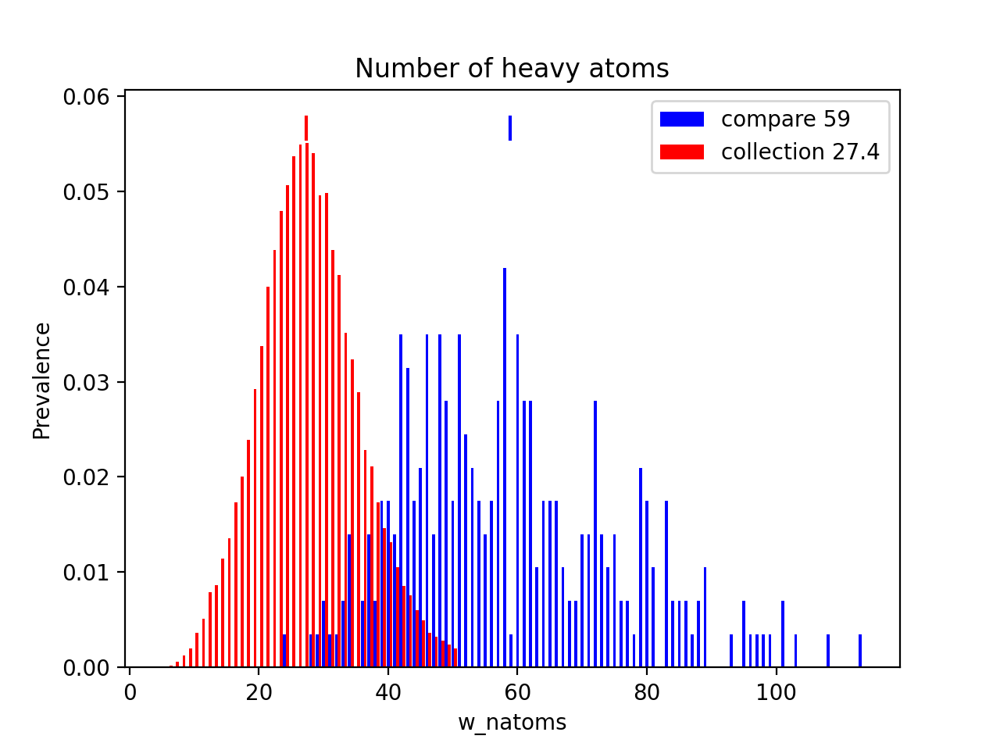

# Molecule Property Profile

`molecular_property_profile` is a set of python scripts that generate molecular
property profiles. When comparing sets of molecles, two different collections,
actives vs inactives, understanding differences between sets can be informative.

The tool works in three phases.

1. Compute molecular descriptors for the collection(s).
2. Computed molecular descriptors are examined and put into a common data format.
3. Those common data formats are used to generate plots.

The tool is set up to work with molecular descriptors computed by `iwdescr`.
Within Lilly, we can compute those via
```
iwdescr -i ICTE -g all -l -O all file.smi > file.w
```
The `-i ICTE` option is important. It tells `iwdescr` to skip over any otherwise
fatal input errors.

You can also add your own features to the tool. You will need to create an entry
in `column_descriptions.txt`, and concatenate your features onto what is
generated by `iwdescr`.

## HOWTO
The process requires three steps.  Computation of descriptors,
ingestion of the data into standardised forms, and then generation of
plots.

For large datasets, it may not be worth generating descriptors for all molecules.
Using a random subset should be fine - although actual max and min values may be
missed.

### Generate Data Files
The first step is to generate molecular features, as described above.

In order to generate the profile data use
`Molecular_Property_Profile/generate_profile.sh`. If the collection was called
'Actives', that invocation might be
```
generate_profile.sh --collection Actives --stem Actives --color green file.dat
```

This will create a number of files of the form
```
Actives_w_natoms.dat
Actives_w_nrings.dat
Actives_w_xlogp.dat
```
where the summarised data for each descriptor has been written to a separate file.
There will be a number of these files. The features that are processed are in the
file `column_descriptions.txt` in the same directory as the scripts.

### Options
#### --collection
Name for this collection. Will be stored inside the files generated.

#### --stem
File name stem for data files generated. Should be meaningful, and might be
the same as the value used for `--collection`. It might also be desirable to
store different collections in different directories.

#### --color
Default color used when plotting this collection. This can be over-ridden
by the '--color' option of `plot_collections`.

#### --ok_missing
By default, if a feature mentioned in `column_descriptions.txt` is missing, a
fatal error occurs. With this option in effect, those are skipped.

## Generate Plots
Once the data files are available, `plot_collections.sh` can be used to make plots
from the data files. One or more pre-existing collections can be plotted.

To get plots of the single dataset generated above,
```
plot_collections.sh --compare Actives -stem Actives
```
should do it, generating a bunch of 'Actives_w_natoms.png` type files. These
might look like


This time the `--stem` option specifies the file name prefix of the
.png files that get generated, and `--compare` is the path name prefix of
a previously generated set of files.

In this particular case, the 'compare' molecules are much larger than
what is found in 'collection'. The means are shown at the top of the plot.

## Comparisons
Given more than one set of precomputed data files, `plot_collections` can be used
to generate comparison plots. All that is needed is to add multiple `--compare` options,
each pointing to a set of precomputed files. This distribution comes with precomputed
files for Chembl, so if you wanted to do a comparison of molecules vs Chembl, that
might look like
```
plot_collections.sh -stem Actives_vs_Chembl --compare Actives --compare /path/to/Molecular_Property_Profile/CHEMBL/CHEMBL --color red,green
```

## Options
### --quantile
Some distributions have long tails, and as a result, plots may become compressed,
and too hard to see relevant information. Use the `--quantile` to specify a quantile
at which the data will be truncated - typically this will be a large number near
100.

### --xmin --xmax
Alternatively you can specify the X range for plots. This only works in the case of
plotting a single feature.

### --int2c
Some plots look better as bar plots (number of rings), others better as continuous
curves (xlogp). There are some features that even though they are integer valued,
they look better plotted as curves. The `--int2c` option specifies the number of
distinct values above which an integral value feature will be plotted as a 
continuous distribution. A value of 20 or 30 can produce pleasing results.
