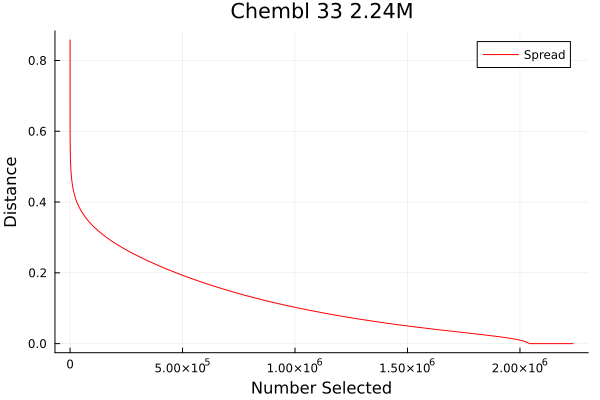
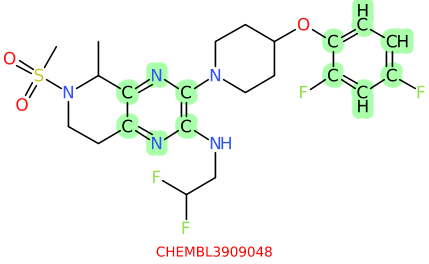
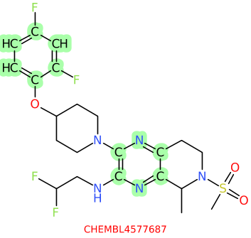

# Molecular Diversity
Molecular diversity is commonly used in Cheminformatics, but there is
no universally accepted definition of molecular diversity. That is
fine, because there are a great many different ways in which molecular
diversity measures can be applied.

We examine three common cases here

1. Internal Diversity
2. Activity Guided Diversity
3. Inter Collection Diversity.

## Diversity Measure
Most diversity studies require some measure of similarity between
individual molecules. This might be a fingerprint measure, a measure
based on a descriptor space, or a measure based on position in an
embedding space. All are likely quite reasonable choices. While this
document will focus on a fingerprint computation available within
LillyMol, the principles outlined here can be applied to any
individual measure of molecular similarity.

That said, the default gfp fingerprint has found widespread
acceptance as a reasonable approximation to human perception of
molecular similarity, and works well in the scenarios outlined
here.

## Internal Diversity
A common task is to determine measure(s) of the diversity embodied within a
given collection, or to select a diverse set of molecules from
a larger collection. For this a spread design, also known as max/min
selector, approach seems to provide both an intuitively pleasing
measure, together with reasonable run-time characteristics.

Spread is a greedy approximation to a hard task. The hard task
would be to identify a sequence of molecules from a set that
maximises the diversity of the molecules as they are selected.
Or more generally, if we were to select 1000 molecules, what is the most diverse
1000 molecules that could be selected? Solving that problem
is hard, but the spread approximation makes this feasible, while
giving up little in terms of accuracy.

### Spread
Spread works by selecting a first molecule - this can be either
a randomly selected molecule, the first molecule in the input
or the molecule that is furthest away from any other molecule
in the set.

Once a first molecule is selected, the next molecule selected
is the molecule that is furthest away from the first molecule.
After that, the third molecule will be the one that is furthest
away from any already selected molecule. That process continues
until either the required number of molecules have been
selected, or the whole set has been ordered into an ordering
ranked by diversity.

As new molecules are selected, there will be a monotonically
decreasing distance recorded between the newly selected molecule
and something previously selected. It is that trajectory that
I believe provides one of the most useful measures of the internal
diversity of a set of molecules.

## Example
For example, take a subset of Chembl version 33 with 2.24M molecules.
Generate fingerprints, and run spread.
```
gfp_make.sh chembl.smi > chembl.gfp
gfp_spread_standard -h 8 -r 10000 -v chembl.gfp > chemb.spr
```
We run 8 OMP threads, and report progress to stderr every 10k
molecules selcted.  On fairly recent hardware, this takes
about 6 hours. The number of computations performed is large:
N for the first molecule, N-1 for the second, N-2 for the
third, so 2.24M factorial.

But the molecules are selected sequentially, so if smaller numbers
of molecules are needed, that can be relatively fast. For example
the first 10k molecules were reported within about 5 minutes.

The file generated is a TDT file that can be processed with
`nplotnn`, or `nn2csv`. It consists of each of the newly selected
molecules, followed by the closest previously selected molecule.
In the case of Chembl, we can generate a distance trajectory plot
via
```
nplotnn -c 4 -n 0 -s chembl.spr | iwcut -f 4 - > chembl.spr.txt
```
which contains a single column of distances. That might look like



We see that as the first molecules are selected, all of the newly
selected molecules are very far away from anything already selected,
distances above 0.4. But as more and more molecules are selected,
by necessity, the newly selected molecules become progressively
closer to molecules already selected.

What we see is that you can select a 500k subset from Chembl
and no two molecules in there will be closer than 0.2. This
is a very diverse set of molecules!

It can be very informative to superimpose trajectories from
different collections - possibly with a normalisation
across the X axis to account for differing numbers of molecules.

Towards the end of the selection process, zero distance
molecules are encountered. These are duplicates, either
by counterions, chirality or differing representations that
have been coalesced by the chemical standardisation built
into LillyMol.

Before the zero distance molecules, we get pairs that are
very close. For example




which differ by the substitution pattern on the aromatic
heterocycle.

A spread selection provides a very informative measure of the
internal diversity of a set of molecules, while retaining
ease of understanding.

On a large set of molecules, it may make sense to terminate
the calculation once the distance has dropped to a given
value, which can substantially shorted the computation.

## Other Measures
Something that people often find informative is the notion of
scaffold ratio - how many distinct scaffolds are in the collection.
In the case of Chembl, there are either 664k unique scaffolds,
if substitution patterns are ignored, or 1.17M if different
substitution patterns are differentiated. Using the first
number, we have a scaffold ratio of 3.36, or for every
scaffold, there are 3.36 exemplar molecules. In combinatorially
derived sets of molecules, this ratio tends to be higher.

If we look at the first 64k molecules selected from Chembl by spread,
those exemplify 52097 unique scaffolds, leading to a scaffold
ratio of 1.2, showing that spread selection is also leading
to a diverse sampling of the available scaffolds.

Molecular Property Profiles should always be generated for any
collection of molecules of interest, see
[Molecular Property Profile](/contrib/Molecular_Property_Profile/README.md)

It would be possible to compare the molecular property profile of the
first N selected vs the overall collection. Generally spread picks very
strange molecules at first - the outliers of the set, so there
might very well be differences from the overall set.

## Activity Guided Diversity
If the task is to select a diverse subset of molecules, subject to
some known measure of desirability, there are many approaches. The
easiest approach would be to just select the N most desirable
molecules. But this is seldom optimal, since many of the most desirable
molecules might be very similar to each other.

Instead we frequently want a subset that offers a combination that
must be enriched with active molecules, while also offering some
measure of diversity within the set.

Again, to do this properly is a hard problem, but again, we take greedy
approaches to make this problem approachable. Experience shows that
these approaches do not sacrifice much at all in terms of overall
result, while being orders of magnitude faster.

My
favourite is usually sphere exclusion, where the input molecules are
sorted by desirability, and `gfp_leader` run on the resulting
fingerprint file. When a fixed radius is specified, a set of
desirable molecules, where no two are within that distance of each
other is produced. Alternatively, you might choose to use a variable
radius, with a smaller radius given to the most desirable molecules,
in order to over-sample them relative to others. It all depends on how
confident you might be on the desirability measure.

An equally valid approach is to use a weighted spread design, where
each fingerprint is assigned a weighting according to its relative
desirability. The distance used to select the next molecule is weighted
by its relative desirability, leading to a well controlled balance
of desirability and diversity. If the starting set of molecules is
diverse, spread _will_ identify the outliers - as it should. You may
need to either remove, or significantly downweight these molecules.

These two methods provide easy means of generating subsets of molecules
that are both internally diverse, while significantly enriched in the
most desirable.

The other thing to note is that you have x Million molecules and
need to select 1000, it is very unlikely that anything beyond
the top 20 or 50k molecules will be relevant, so a potentially large
calculation can often be short circuited by simply discarding the
vast majority of the candidates, which are very unlikely to be
selected anyway.

## Inter Collection Diversity
If two collections are to be compared, there are many approaches.

First molecular property profiles of the two collections should be
generated and compared. This is almost always interesting and informative.

The internal diversity of each set can also be computed, and
compared. Compute the scaffold ratio for each, number of unique
ring systems, many possibilities.

If you have scaffolds and/or rings as unique smiles for each collection, it is
an easy (string) operation to work out the overlap between the two.

But the most detailed way of comparing two sets is to do a
pairwise fingerprint comparison. This will necessarily be 
expensive, although for moderate sized collections, quite doable.

For example, if one were to compare Chembl with Chembl, 2.24M that
will take a while. But the task can easily be parallelised.

Start with the already generated fingerprint file for chembl and
split it into chunks of 50k molecules each.
```
gfp_make.sh chembl.smi > chembl.gfp
iwsplit -tdt -n 50000 chembl.gfp
```
This generates a sequence of `iwsplit*.gfp` files, each 
containing 50k fingerprints.

Each of these can be compared against the entire set via
something like
```
time gfp_lnearneighbours_standard -p iwsplit1.gfp -n 1 -v -r 50000 chembl.gfp > iwsplit1.nn
```
which on a relatively modern machine, takes just over 6 minutes to do the 50k vs 2.24M 
comparisons - it is running parallel with omp. The rate is about 580 M similarity
computations per second, or 72M per core per second.

Even if the job were to be done in serial, the overall time would be
about 50*6 minutes or 300 minutes or 5 hours. Not that different from
what the spread run took. The advantage here is that these chunks can
be run in parallel.

Within dopattern that might look like
```
dopattern.sh -o 50 'gfp_lnearneighbours_standard -p iwsplit%.gfp -n 1 chembl.gfp > iwsplit%.nn'
```
with the execution directed to a cluster, for simultaneous processing.

These individual .nn files can be collated with nplotnn

```
nplotnn -H histogram.txt -v iwsplit*.nn > all.nn
```
With the file `histogram.txt` containing a histogram of the nearest neighbours.
`nplotnn` has a wide variety of options for identify close or distance neighbours,
which may be of particular interest.

Other approaches might include subsampling either collection. But the
problem here is that it is often the closest distances that are the most
important when comparing two collections, so that is generally not preferred.

If the intent is to add one collection to an existing collection, gfp_spread
can do that. The previous collection is provided as the -A option and the
new molecules are first compared with that set. But as we have seen here, that
might be a daunting calculation. Instead gfp_spread can consume the output
of the nearest neighbours file generated above, leading to an
unencumbered final spread selection - there is no run-time penalty for this.

If you wish to restrict attention to very close neighbours it might be
possible to sort the collections into different atom count buckets, and
only compare across buckets of similar size. This is what the `-W` option
to many `gfp_*` tools does.

Clearly these N^2 algorithms are much slower than algorithms that work by
projecting molecules into a common representation. If you have a space that
can reliably minic expected similarities, that will clearly be more scalable.
The real challenge is whether or not such a satisfactory space exists.
