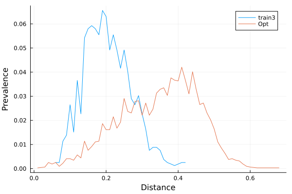

# train_test_split_optimise

For challenging a machine learning model, it is often desirable to have
well separated train and test splits of the data.
This tool is designed to iteratively optimise the a train test split in order to 
achieve better separation between train and test.

## Details
The tool reads a TFDataRecord file of serialized nnbr::NearNeighbours protos.
This must be a nearneighbours computation done with a maximum distance,
*not* a number of neighbours. The tool does not check for this.

It works by randomly making an initial random assigment to train and test splits
according to the fraction specified on the command line.

Then at each step, it randomly selects two items, one from train and one from test,
and swaps their set membership. It then determines whether or not that makes for
an improvement in separation between the classes. If so, the change is
accepted, if not the items return to their starting state. By always selecting
items on opposite sides of the train/test divide, the overall ratio between
classes is preserved.

# HOWTO
First generate fingerprints and neighbours. Use as long a distance as seems reasonable.
```
gfp_make.sh file.smi > file.gfp
gfp_nearneighbours_single_file -v -T 0.4 file.gfp > file.nn
```
Convert to tfdata format
```
nn2proto -T file.tfdata -v file.nn
```
Note that eventually `gfp_nearneighbours_single_file` will be able to 
generate this file directly.

Update: That is now available.
```
gfp_nearneighbours_single_file -v -T 0.4 -S file.tfdata file.gfp 
```
Depending on the size of the dataset and the distance selected, this
file can be large.

Run the optimisation.
```
train_test_split_optimise -f 0.8 -n 10 -S SPLIT -o 1000000 -v -r 10000 file.tfdata
```

In this case we request 0.8 (80%) `-f 0.8` of the data to be in the train split.

We request 10 splits `-n 10`

For a dataset with about 2k molecules, we request 1M optimisation steps `-o 1000000`. Generating
10 splits, this takes under 2 minutes. Because we added the `-v` option, it reports that
for most splits only about 1100 changes were accepted. But some of these acceptances
were done at the 800,000+ step. But note there are only 2200 molecules in this
particular set, and once the initial split is made, some rigidity is baked in.

Outputs are written to 40 files `-S SPLIT`. For each of the 10 splits there will
be files like `SPLITR0` and `SPLITE0`. These contain the ID's of the tRaining and tEst
splits for split number 0. There are corresponding smiles files `SPLITR0.smi` and
`SPLITE0.smi`.

The `-r `10000` option says report progress every 10k optimisation steps. This will
help you understand how the optimisation is going, and help provide guidance on the
best choice for number of optimisation steps.

With a larger dataset of 18k molecules, and asking for 10M optimisation steps,
that took about 15 minutes per split. From the log file we can track the number of
successful switches as a function of the number of optimisation steps attempted,
the second column.
```
0 1000000 score 2272052895 cmp 2196407176 accepted 7631 0.007631 last successful 998048
0 2000000 score 2272081497 cmp 2196407176 accepted 7684 0.003842 last successful 1973272
0 3000000 score 2272105044 cmp 2196407176 accepted 7702 0.00256733 last successful 2974030
0 4000000 score 2272089925 cmp 2196407176 accepted 7712 0.001928 last successful 3909061
0 5000000 score 2272117855 cmp 2196407176 accepted 7714 0.0015428 last successful 4955401
0 6000000 score 2272073459 cmp 2196407176 accepted 7724 0.00128733 last successful 5938260
0 7000000 score 2272085453 cmp 2196407176 accepted 7726 0.00110371 last successful 6344703
0 8000000 score 2272066576 cmp 2196407176 accepted 7728 0.000966 last successful 7647757
0 9000000 score 2272112930 cmp 2196407176 accepted 7730 0.000858889 last successful 8533012
```
We see that after 1M steps, it had found 98.7% (7631/7730) of the number of successful matches
it found after 10M steps. Clearly 10M was too many steps. 2M steps sees 99.4% of
the successful optimisations found. This is on very old hardware...

Clearly we need to add an option to terminate an optimisation if it has
become unproductive.

Does this actually work? It appears the answer is yes.

We can plot the distribution of nearest neighbours generated via two different
splitting strategies. One is a selection designed to introduce a measure of
separation between train and test, and the other is this method. Normalised
distributions of distances are shown.



We see that the designed split has significantly shifted the distribution of
nearest neighbour distances between sets to longer distances.

Does this make a difference for models? Indeed yes. Using the BBB dataset from
[Kaggle](https://www.kaggle.com/datasets/sachinkg7/bbbp-dataset-ai-project)
we can use svmfp models to build models (80/20 random train/test split)
with AUC values of 0.95.  If instead we use designed splits from this tool
the AUC drops to 0.74.

In reality, both the random splits of the data and optimised splits are
unrealistic compared to what would likely be encountered in real world
situations. If your data can be divided chronologically, the performance
across chronological splits will be the most realistic estimate of
performance in the real world. But if that is not possible, this tool
could be used to give a worst case estimate.

This might also be useful for determining which of competing model
building methods might be most robust to disparate new data.

But somewhat puzzlingly, even though it is intuitively obvious that
very dis-similar molecules will be harder to predict, when we look at
model reliability measures, this simple estimator does not provide
fine grained reliability estimates. There is usually a trend towards
worse predictions as separation increases, but a very noisy trend.

## Caution
The separation is done without regard to any relationship to
a response, so if a dataset undergoes optimisation with this tool,
the optimised splits may have quite different activity characteristics
than what a stratified, or random set might have.

# Conclusion
`train_test_split_optimise` generates well separated train/test splits
that are both measurably more separated than random or other splitting
strategies, and which have been found to be very challenging for
model building.
