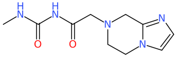
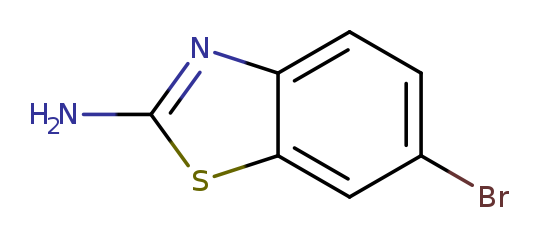
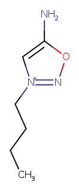
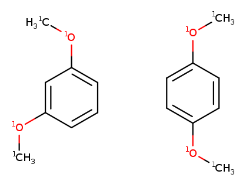
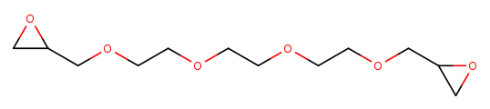
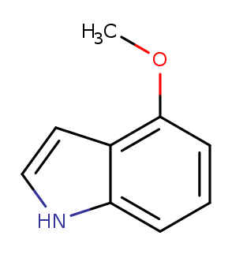
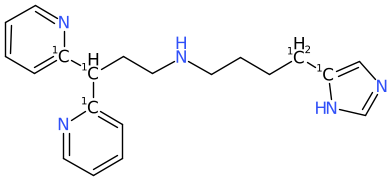
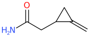

# Substructure Searching

LillyMol provides a great deal of flexibility for substructure searching.

Query information can be specified via several means

* smarts
* historical query file
* textproto query file
* ISIS query file
* Some Chemaxon smarts extensions

## Smarts
This is the most common query form used. LillyMol's implementation of smarts
is generally compatible with other implementations. It contains several useful 
extensions to smarts.

## Extensions

### Logical Operations
The `Substructure_Query` object at the heart of LillyMol consists of a list of
individual `Single_Substructure_Query` objects. These individual substructure
queries are linked by logical operators.

This can be expressed in smarts via a notation similar to what we use in
atomic smarts logical expressions.

For example
```
C&&[R]
```
matches any molecule that contains an aliphatic Carbon atom, and an atom in a ring. Note that
this could be the same atom. The more traditional `C.[R]` will match a molecule
that has an aliphatic Carbon atom, and a different atom that is in a ring. Within the
Substructure_Query object, the component queries are evaluated separately.

There is one important caveat to these composite queries. If the matched atoms are returned,
the matched atoms will be for the last component that was evaluated. So, if the query was for
either a Carbon or a Nitrogen atom `[#6]||[#7]`, if the molecule contains a Carbon
atom, the Nitrogen query is not evaluated and the matched atom returned will be the
first carbon atom. If the query was for both a carbon and a nitrogen, `[#6]&&[#7]` the
matched atom returned will always be the first Nitrogen.

If the and query was formulated as `[#6].[#7]` each query result would be two matched
atoms, with the first being a Carbon and the second a Nitrogen. These are
necessarily different atoms.

The xor operator is supported, so if you want molecules that have either a Chlorine or
a Bromine, but not both `Cl^^Br` should do that. The low priority and operator, `;;` is also
supported, so complex queries can be constructed.

The most common use is the `or` operator, where multiple queries for a reagent
might be used to cover slightly different reagent types. Note too that
by placing the most reactive group first, that is what will be returned
if the molecule contains multiple matching groups.

For example to perform a reaction which uses a primary amine first, a secondary
amine next and then an aniline
```
[NH2]-[CX4]||[ND2HR0](-[CX4])-[CX4]||[NH2]-a
```
would do that with a single query. The most reactive group would be preferentially
returned by the query.

### Numeric Qualifiers
Expecially when preparing reagents for enumeration, it is often necessary
to identify molecules that have just a single instance of a functional group. To
find molecules that have just one carboxyllic acid
```
1[OH]-C=O
```
will do that. That might be combined with something like
```
1[OH]-C=O&&0[OH]-S(=O)=O
```
which means you need 1 carboxyllic acid, and zero sulfonic acids.

It is difficult in standard smarts to exclude a group. But if you wanted
molecules that did not contain Phosphorus `0P` would do that.

Relational operators are supported. So if you wanted molecules with fewer than 4
Sulphur atoms `<4[#16]` would do that.

It would be nice to be able to specify a range, but that is currently not
possible. So if you need between 4 and 6 Nitrogen atoms,
```
>3[#7]&&<7[#7]
```
is all that you can do. This is of course very inefficient since it is
run as two queries. 

If this becomes important, we could implement `{4-6}[#16]`, but that is
not there today.

#### Caution
Beware that some substructure queries match multiple times. For example
if you wanted molecules with just 1 nitro group, `1O=N=O` that will
never match - because this representation is symmetric, so there will
always be two matches to the query. Tools like `tsubstructure` have
options for suppressing these non-unqiue matches. But in default
behaviour, `2O=N=O` matches molecules that have just one Nitro group.
Similarly, `12c1ccccc1` matches molecules that have exactly one
benezne ring.

`tsubstructure` has a -u option, which means unique embeddings only. If that
is used, then each benzene ring returns just 1 match. The other option is
one embedding per start atom (-r in tsubstructure). With that in effect,
once the first query atom
finds a match, do not go looking for more matches at that same atom. In that
case benzene has 6 matches. The `-u` option is most commonly used.

Similarly if looking for an amide `N-C=O`, if the molecule contains
a urea group, that query will, by default, match two times. The query
could be rewritten as `O=C-N` and use one embedding per start atom,
or the embeddings do not overlap directive `-M edno` in `tsubstructure`.

Another approach might be to use a recursive smarts `O=[$([CD3]-N)]` which does not report the
Nitrogen atom as a matched atom. For matching this might be ok, but in
a context where you need the matched atoms, this does not work. This
also does not address the urea problem, although obviously the recursive
smarts could be extended to `O=[$([CD3](-N)-[!N])]` which is starting
to become complex.

Differentiating an amide from a urea can also be done with an
environment_no_match` directive in a query file.
```
query {
  smarts: "O=[CD3]-[NG0]"
  environment_no_match {
    attachment {
      attachment_point: 1
      btype: SS_SINGLE_BOND
    }
    smarts: "N"
  }
}
```
But note that this query will match molecules like

which contain both a urea and an amide - that share a Nitrogen atom.
We could also exclude matches where there is another C=O atom attached
to the matched Nitrogen atom.
```
query {
  smarts: "O=[CD3]-[NG0]"
  environment_no_match {
    attachment {
      attachment_point: 1
      btype: SS_SINGLE_BOND
    }
    smarts: "N"
  }
  environment_no_match {
    attachment {
      attachment_point: 2
      btype: SS_SINGLE_BOND
    }
    smarts: "C=O"
  }
}
```
where one environment_no_match checks what is attached to matched atom 1,
the Carbon atom, and the other checks what is attached to the Nitrogen atom.
Again, these could also be accomplished by recursive smarts, but at the
cost of considerable complexity if primary, secondary and tertiary amides are
to be handled.
```
O=C([$([!N])])-[$([ND1]),$([ND2]-[!$(C=O)]),$([ND3](-[!$(C=O)])-[!$(C=O)])]
```
yields the same results.

This case points to the fact that within LillyMol
substructure searching there are frequently many different ways of
doing the same thing. These will differ in their complexity, and
efficiency.

In the case above, the query file processes 20k molecules in 0.65 seconds
whereas the smarts based query takes 10% longer.

### Diversion
Smarts has been referred to as a write-only language, with extraodinarily
complex smarts being written by experts. These create maintenance
nightmares for those who follow. While LillyMol does support complex
recursive smarts, many of the extensions are designed to help
avoid them.

That said, the contrib directory contains a python script, `mkbenzene`
that will generate an arbitrarily sized recursive smarts for
benzene. LillyMol has
successfully performed a substructure search on a 2 MB recursive
smarts generated by this tool. Took 4 seconds.

Here is what that smarts might look like, but again, the one
actually used was 2MB
```
[$(c%66[$([0#6H1r6R1D2X3x2+0a]%35[$([0#6H1r6R1D2X3x2+0a]%11[acr6][$([acr6]%14[cH1a][cX3H][0#6+0a]c[ac]%14)][cH1a]c[ch]%11)][acr6][$([$(cc)]%15[cR1]c[0#6+0a][cH1a][#6aH]%15)][cR1]c%35)][$([cR1]%59[ch][c^n][#6aH][$([cR1]%69[#6aH][0#6+0a]c[cD2][$([cR1]%24[acr6][ac][cH1a][cX3H][$(cc)]%24)]%69)][$(cc)]%59)][$([ch]%91[0#6H1r6R1D2X3x2+0a][x2Hc][c^n][$(c%38[c^n][ch][ac][cH1a][cX3H]%38)][cX3H]%91)][$([0#6H1r6R1D2X3x2+0a]%53[ch][acr6][ac][cD2][$(cc)]%53)]c%66)] #10
```
Generate this by
```
mkbenzene.py --write_last --nsmarts 50000 > /tmp/50000.smt
```
and test with
```
time tsubstructure -q S:/tmp/50000.smt benzene.smi
```
which should record one match.

### Linker Groups
Linker groups can be expressed via the `...` construct. For example, to
find amides that 'face away from each other', something like
```
NC(=O)...C(=O)N
```
will do that. In this case the `...` is interpreted as 'no matched atoms
between'. This construct however has a variety of qualifiers that can
impose constraints on the size and contents of the atoms between the
ends.

The best location of documentation for this feature is in the source
file [substructure.h](/src/Molecule_Lib/substructure.h), where several
use cases are outlined. For example
```
   {>3;0[c]}  More than 3 bonds, and no aromatic Carbons.
```
Refer to that file and also the file containing C++ 
[unit tests](/src/Molecule_Lib/substructure_nmab_test.cc)
which also contains several examples of using the `...` linker group
specification. While complex, it can be very useful.

Whether it is better to express a complex linker relationship in
smiles or via a query file is an open question.

## Atomic Smarts Extensions
LillyMol's atomic smarts also contain some useful extensions.

### Relational Conditions
Most atomic properties support > and < modifiers. So, `[CD>2]` will
match 3 or 4 connected Carbon atoms. One of the most useful
conditions is when matching isotopes, `[>0]` matches any isotopic
atom.

Unfortunately relational conditions are not supported with atomic
numbers or formal charge. If it ever becomes important it would be
easy to implement `[#<17]` for example, but at the cost of slowing
down all matching on this frequently used atomic property.

### Arbitrary Elements
In LillyMol any one or two letter combination can be a valid element.
Such elements do not have an atomic number, mass, valence or any
property, but they can be matched. Enable all one and two letter
combinations by adding `-E autocreate` to any LillyMol executable.

In addition, LillyMol elements can be of any length. So, if the `-E anylength`
option is specified, most programmes will happily snarf `[Ala][Leu][Gly]`.
These can be substructure searched as
```
[#{Ala}]-[#{Leu}]-[#{Gly}]
```
More generally peptides can be searched with queries like
```
[#{Ala}]-*-*[#{Glu}][#{Cys]
[#{Ala}]...{4-8}[#{His},#{Leu}][#{Ile}]
```
leading to considerable creativity when treating peptides as 'atoms'. 

### No attached heteroatoms
Chemists often formulate an atom constraint as `either Carbon or
Hydrogen` which is problematic if Hydrogens are implicit. Usually
what they are actually saying is there is a restriction on the
number of heteroatoms attached at a particular point. The `T` 
directive is attached heteroatom count.
```
[CT0]
```
is a carbon atom with no attached heteratoms, whereas
```
[CT<2]
```
is a carbon with either zero or 1 heteroatoms attached. This
can also be expressed as `[CT{0-1}]`. Most atomic properties
support the RDKit range specifier.

### Unsaturation
It is common to need to specify an atom that is either fully
saturated, or to have some degree of unsaturation, regardless of
atom type. `[G0]` specifies a fully saturated atom of any kind.
`[G>0]` specifies an atom with some degree of unsaturation. Note
that aromatic atoms are considered unsaturated. `[G1]` will match
most atoms one double bond, and `[G2]` will match 
atoms with a triple bond attached.

## Not enough letters!
As work continued on LillyMol, we found increasingly complex
requests coming from chemists, and it was clear that we would run
out of letters. For that reason we introduce a new construct, `/IW...`
by which atomic smarts can be extended to other concepts without
restriction.

The following `/IW` atomic smarts extensions are recognised.

* /IWrid
* /IWfsid
* /IWfss
* /IWVy
* /IWAr
* /IWspch /IWscaf
* /IWhr /IWrh
* /IWrscb
* /IWsymd
* /IWsymg
* /IWKl
* /IWorganic
* /IWnonorganic
* /IWspiro
* /IWcipR /IWcipS
* /IWNv
* /IWgid
* /IWx

### /IWrid
Specify a ring id for an atom. A query only matches if all atoms that have
the same ring id are in the same ring. In order to find all N,N aromatic heterocycles
`[/IWrid1n].[/IWrid1n]` will match all molecules where there are two
aromatic Nitrogens in the same ring.

### /IWfsid
Specify a fused system id for an atom. A query only matches if all atoms that have
the same fused system id are in the same fused system. For example, to find all
molecules that have two aromatic Nitrogen atoms in a fused system, but where the
Nitrogen atoms are in different rings `[/IWfsid1/IWrid1n].[/IWfsid1/IWrid2n]` would
do that. The fused system identifiers must match, the ring id's must not.

Note that both `rid` and `fsid` are limited to single digits. That limitation
is lifted in a query file.

### /IWfss
Fused system size, the number of rings in a fused ring system. For example to find a
fused aromatic bicycle that has an NH2 on one ring and a halogen on the other ring
```
[/IWfss2/IWfsid1/IWrid1a]-[NH2].[/IWfsid1/IWrid2a]-[Cl,Br,I]
```
matches molecules like

and also molecules that might be in 5,5, 5,6 and 6,6 fused systems.

### /IWspiro
Matches spiro fused atoms. Note that matching spiro fused atoms can also
be done using the ring id
```
[/IWrid1R]@[CD4x4](@[/IWrid1])(@[/IWrid2])@[/IWrid2]
```
will do that. The atoms on the LHS are in ring id 1, and the
atoms on the RHS are in ring id 2. The `[/IWspiro]` directive is much
simpler to use.

It is important to note that by default, in LillyMol ring systems do **not**
extend across spiro fusions. Sometimes this is frustrating, sometimes this is
very helpful. So things like fused system size do not cross spiro fusions. Therefore
`[/IWfss1/IWrid1]@[/IWspiro]@[/IWfss1/IWrid2]` will match only spiro fusions
with a single ring on either side of the fusion - the fused system size
directives pertain separately to each side of the spiro fusion.

### /IWcipR /IWcipS
Currently there is rudimentary support for Cahn Ingold and Prelog stereo
designators in `trxn`. Currently the implementation does not do shell expansion.
TODO:ianwatson implement shell expansion.

### /IWspch /IWscaf
This directive only matches atoms that are in the scaffold or the 'spinach' (the
complement of the scaffold). So if you wanted to match an amide that was in a region
between rings, `[/IWscaf1C](=O)!@N` would do that. This would be the same as
`[/IWspch0C](=O)!@N`

### /IWrscb
Scaffold bonds attached to a ring. This is useful in matching atoms that are
in a 'terminal' ring - a ring with only a single chain connection to rest of
the scaffold. In that case `[/IWrscb1]` only matches atoms that are in a
terminal ring. On the other hand if you must match an atom that is attached
to an 'inner' ring, that might be `[/IWrscb2a]-F` for example. Increasing
the number will result in more 'joined' rings being matched.

### /IWhr /IWrh
The atom matches only if it is in a heterocyclic ring. Note that this atom
counts towards the number of heteroatoms in the ring. So, `[/IWhr1n]` will
match pyridine. The query `[/IWhr>2nD3]` will match an aromatic nitrogen,
that is 3 connected, and which is in a ring with 3 or more heteroatoms,
including this one.



Note that the required heteroatom count was achieved with two Nitrogen
atoms and one Oxygen. Note too that there is no constraint on aromaticity,
specify that as a separate atomic property when needed.

### /IWorganic /IWnonorganic
LillyMol has the concept of an 'organic' element. By default these are C, N, O, F, S, P,
Cl, Br and I only. Therefore `[/IWorganic]` will match any of those elements,
and `[/IWnonorganic]` will match anything else.

### /IWVy
Only match the atom if there is an Vinyl like group adjacent, one of the
adjacent atoms is unsaturated. Note that aromatic atoms are **not** considered
unsaturated. Unfortunately there are different definitions of unsaturation buried
in LillyMol. New work excludes aromatic.

### /IWAr
Only match the atom if there is an Aromatic atom adjacent. It is probably
easier to just use `[....]~a`, or as another alternative, use a
recursive smarts. Note however that this check does not consider whether
or not an atom has been matched, it is an intrinsic property of an atom.

### /IWsymd
There are two symmetry related atom matching directives. `IWsymd` specifies
the degree of symmetry. An atom that is not symmetric with anything else in
the molecule will have a symmetry degree of 1. The F atoms in a CF3 will have
a symmetry degree of 3. Note that this property is expensive to compute.

### /IWsymg
Symmetry group. Only match if all atoms that have the same symmetry group
match. For example to match two symmetric `OMe` groups, `[/IWsymg1OD2]-[CH3].[/IWsymg1OD2]-[CH3]`
matches


To find well separated symmetric atoms, you might try something like
`[/IWsymg1]...{>12}[/IWsymg1]` which will match things like 


### /IWgid
This is used in conjunction with the `set_global_id` directive in a query
file. Within a query file, one might look for a ring with particular
characteristics, and to assign the atoms in the ring/ring system that
matches to a global id number. Those matched atoms can then be used
in smarts via the `/IWgid` value.

For example, we are looking for a methoxy attached to the 6 membered ring
of a 5,6 fused aromatic. The query file might look like
```
name: "halogen on 6 ring in 5,6 fused aromatic"
query {
  ring_system_specifier {
    rings_in_system: 2
    aromatic_ring_count: 2
    ring_size_requirement {
      ring_size: 5
      count: 1
    }
    ring_size_requirement {
      ring_size: 6
      count: 1
    }
    base {
      set_global_id: 4
    }
  }
  smarts: "[/IWgid4r6a]O[CD1]"
}
```
which matches molecules like


Note that in this particular case, the same **overall** effect could be
achieved by using an environment within the `ring_system_specifier`,
but those matches do **not** match any atoms - ring system requirements
are implemented as a pre-match filter before atom matching is done.
The `set_global_id` functionality makes such atoms available for matching
during atom matching and therefore available in
reactions and other matched atom specific needs.

### /IWKl
Only match the atom if all rings containing the atom likely have differing
Kekule forms. Not sure if this is a useful idea or not, but it was needed
for solving a particular problem.

### /IWx
Within LillyMol there are many tools that use the list of matched atoms
in order to do various things. Sometimes it can be convenient to specify
an atom, but to not have that atom recorded as a match. Often times the
same effect can be achieved via a complex recursive smarts. You only
need to think about this if processing embeddings returned from a
substructure search, in `trxn` for example, where different queries
might need to return the same matched atoms.

### /IWNv
Several tools assign numeric values to queries or atoms. This is a means of
associating a numeric value with a particular matched atom. Only useful
for low level programming.

If the number is a positive integer something like `[/IWNv23C]` will work
but if negative or floating point numbers are needed, then `[/IWNv{-3}C]`
is needed. Note that since the '.' character is special in smiles, if
you have a floating point number it must instead be entered with an
underscore `[/IWNv{-3_14}C]` which is interpreted as `[/IWNv{-3.14}C]`.

## Future
As use cases emerge further `/IW` directives may be added. Some can be
evalated during atom matching, others are applied after an embedding has
been found.

## Other Messages

Proto specifications of substructure match conditions allow specification of
several useful concepts related to more general descriptions of regions of a
molecule.

### Separated Atoms
The SeparatedAtoms message describes bond separations between matched atoms,
as well as rotatable bonds on the path between those matched atoms.

For example the query
```
query {
  smarts: "[OH].[OH]"
  separated_atoms {
    a1: 0
    a2: 1
    min_bonds_between: 3
    min_rotbond: 1
  }
}
```
matches `OCCCCO` but not `Oc1ccc(O)cc1`. This construct can be useful
creating pharmacophore type matches.

### Nearby Atoms
This construct is also useful for pharmacophore type queries, but has
some added flexibility.

For example, to identify an aromatic Nitrogen acceptor with a nearby
amide
```
query {
  smarts: "[nD2H0]:c"
  unique_embeddings_only: true
  nearby_atoms {
    smarts: "[CD3T2](=O)-[NT0G0]"
    hits_needed: 1
    matched_atom: 0
    min_bonds_between: 3
    max_bonds_between: 5
  }
}
```
would do that. But note this imposes no 'directionality' on the amide. If
that were needed, then something like
```
c:[nD2H0]...{3-5}[CD3T2](=O)-[NT0G0]
```
would be needed. But note that in this case, the atoms matched by the
amide are returned as matched atoms, whereas with the nearby_atoms
construct, only the `nc` matched atoms are returned.

A query_file can also be used instead of a smarts in a nearby_atoms
directive, which allows considerable flexibility and re-use of complex
queries.

Beware with the max_hits_needed directive. If specified, this also
includes zero hits. So if you wish to specify both that there must
be at least one match and a max number, you will need to specify
```
  min_hits_needed: 1
  max_hits_needed: 2
```
to specify either 1 or 2 matched. This would be the same as
```
  hits_needed: [1, 2]
```

### Separated Rings
A pharmacaphore type query might involve something like:

```
"A molecule with a a five membered aromatic ring containing 
an [nH] group, and a 6 membered aromatic containing an [nH0] group,
separated by at least 6 atoms"
```
This query can be accomplished with the query file
```
query {
  ring_specifier {
    aromatic: true
    ring_size: 5
    fused: 0
    base {
      set_global_id: 1
      environment: "[nr5H]"
    }
  }
  ring_specifier {
    aromatic: true
    ring_size: 6
    fused: 0
    base {
      set_global_id: 2
      environment: "[nr6H0]"
    }
  }
  smarts: "[/IWgid1c]!@-[/IWscaf1]...{>5}[/IWscaf1]-!@[/IWgid2c]"
}
```
First each of the two rings are defined. Both are aromatic, and
they have different sizes. Neither are fused.

In the first ring, we specify that there must be an aromatic
Nitrogen atom with a  Hydrogen atom. The 'r5' specification is
redundant, but harmless. Same in the other ring where we look
for a pyridine like Nitrogen atom, again with a redundant
specification of the ring size.

The smarts is complex. We are looking for an aromatic Carbon
atom that is in the first ring, then a non-ring bond to an
atom that is in the scaffold. That can only be an atom that
is part of a linker, joining rings. Five atoms away we look
for a non ring atom that is also in the scaffold and is then bonded
to an atom that is in the second ring.

This will identify molecules such as



To identify two separate rings without the distance
constraint could be done with
```
[/IWfss1/IWrid1nr5H]...[/IWfss1/IWrid2nr6H0]
```
Many more matches are found, but there is no separation
constraint on the matches. Note that just using a `,,,` directive
to specify atoms between the matched atoms would not work since
that path may include other atoms in the ring. 


## Down The Bond
There were several times when we needed to place a limit on
the number of atoms in a substituent. This is not as simple
as looking at the furthest distance of an atom in the
substituent, because of branching.

For example to find various methoxy-like
substituents on a benzene, one might limit the size of
the group to a max of 5 atoms.
```
a-[OD2]-{a{1-5}}C
```
The directive is inserted between the two atoms that define the bond, and
atoms down that bond are considered. Note that the 'C' atom in the query
above is *not* considered to be part of what is matched by the down the bond
directive - because it can be fully specified here. If the bond is in a ring, the match will fail.

After this was implemented, we came up with the more general idea
of a substituent, that is only available in query files. A substituent
is a slightly different concept, but for simple cases, a down-the-bond
directive can work well. The DownTheBond message is also available
in a query file.

The down the bond directive now supports further atomic properties. 
Counts of atoms that are

* heteroatom - h
* aromatic - m
* unsaturated - u
* in a ring - r
* atomic smarts [...]

Currently all specifications are treated with an implicit `and` operator,
so all specifications must be satisfied. In addition, multiple specifications
must be separated by an ';' operator - leaving the door open for a future
use case that might implement other operators.

The 'd' directive specified the maximum distance from the first matched atom.
So a bond might have 10 atoms down the bond, but we can restrict the maximum
distance from the first matched atom to 5 bonds, which will ensure branching.

The 'R' directive is not an atom count, but specifies the number of rings
that involve atoms down the bond.

So a complex down the bond smarts might look like

```
[Nx0]-C(=O)-{a{2-5};h0;r>1;u>0}C
```
which is an amide group, then down the bond with between 2 and 5 atoms, no
heteroatoms, at least one ring atom (actually there would be at least
three ring atoms) and at least one unsaturated atom. This matches molecules
like


Note that unsaturation and aromaticity are separate concepts, so unsaturation
only applies to aliphatic atoms. Note that the minimum unsaturation value
will be 2 since an unsaturated bond consists of two atoms that are each
unsaturated.

Looking for a C1-5 secondary alkyl amide might look like
```
O=[CD3T2]-{a<6;h0;u0;m0}[ND2]
```
where we want fewer than 6 atoms down the bond, no heteratoms, no unsaturated
atoms, and no aromatic atoms.

If we wanted tertiary amides, that would be
```
O=[CD3T2]-[ND3](-{a<5;h0;u0;m0}C)-{a<5;h0;u0;m0}C
```
where the same directive is repeated for each substituent. This of
course raises the question whether it is possible to come up with a single
query that will handle primary, secondary and tertiary amides. That is
not possible with a down the bond smiles construct, but is possible with
a query file.

```
query {
  smarts: "[CD3T2R0](=O)N"
  down_the_bond {
    a1: 0
    a2: 2
    max_natoms: 5
    heteroatom_count: 0
    unsaturation_count: 0
    aromatic_count: 0
    match_individual_substituent: true
    no_other_substituents_allowed: true
  }
}
```
This query will *not* match `OCCC(=O)N(CCC)CO`. Nor will it match a primary amide,
since a down the bond specification has bee made, but no match would be made with
a primary amide. Clearly we could add a directive to say that no substituent atoms
would comprise a positive match.

By default, the down the bond directives aggregate all atoms that appear
down the bond, and atomic properties are summed across all substituents
attached to `a2`. If `match_individual_substituent` is set, then
rather than aggregating across all substituents, each substituent is
computed separately and must match the constraints. If a single substituent
is found to satisfy the conditions, a match is reported.

If `no_other_substituents_allowed` is also specified, then the match fails
if there is a substituent that does *not* satisfy the constraints.

Both within smarts and via a query file, an atomic smarts can be specified. Since
that, like all directives, will be followed by a numeric qualifier, it can be
either a positive or negative requirement.

The quite complex smarts
```
[OHD1]-[CD3R0](=O)-[CD3R0](-{[CD2]1;[$(O=c1nsnc1)]1;d3;m5;r5;u1;a7}*)-[ND1H2]
```
will match
!(CHEMBL1094324)[Images/CHEMBL1094324.png]

where we are looking for a `[CD2]` as well as an atom that is the aromatic
ring. Note that these could have been combined, although maybe you want
flexibility. All queries are completely independent. In this case we
also require that the maximum separation from `a2` be 3 bonds, there
be 5 aromatic atoms, 5 ring atoms, 1 unsaturated atoms and 7 atoms.

Note that in all cases only atomic smarts can be specified, but they can
be recursive smarts, and can match any parts of the molecule - including
atoms that are NOT down the bond.

### Substituent
The Substituent message was initially implemented to handle the
environments specified with ring and ring system specifications. These
are similar to DownTheBond directives, but have some other properties
reflecting their origin.

They are somewhat similar to an envionment or environment_no_match
messages, but describe less specific features. They also share a lot
of attributes with the DownTheBond message, but are not neccessarily
tied to a specific bond. Generally prefer using a DownTheBond message
although if the substituent can be attached via multiple sites,
this is more convenient.

The other use case for a Substituent message is restricting matches
to certain functional groups. For example, going back to the previous example
of trying to identify an alkyl amide, the following query might be
an approach to that.
```
query {
  smarts: "[CD3T2R0](=O)N"
  substituent {
    max_natoms: 5
    heteroatom_count: 0
    unsaturation_count: 0
    no_other_substituents_allowed: true
    disqualifying_smarts: "a"
  }
}
```
But because this looks at all matched atoms, it is also applying its
matching restrictions to atoms attached to the Carbonyl Carbon atom.
This may not be what is needed.

Note the significant differences between environments and
substituents. Environments are very specific atom matches that
are directly bonded to specific matched atoms. Substituents are more general
concepts attached to any matched atom. Down the bond messages are
specific to the matched atoms forming a bond.

### Region
Two matched atoms can define a region in a molecule. In order for this to
work, the two matched atoms must *not* be in the same ring system. The
'atom' directive for defining a region is a repeated field, leaving the
door open for regions that might be defined by more than 2 matched query atoms.
But currently only regions defined by two matched atoms are supported.

The query
```
query {
  smarts: "[N].[N]"
  unique_embeddings_only: true
  region {
    atom: [0, 1]
    natoms: 6
    atoms_not_on_shortest_path: 0
    heteroatom_count: [2, 3]
  }
}
```
will match "NCOCOCCN".

Currently only a small number of attributes are implemented for Region messages
but clearly more could be added as the need arises.

The C++ unit tests in the [src/Molecule_Lib](src/Molecule_Lib) directory contain
more examples of proto specifications of complex queries that test these concepts.
