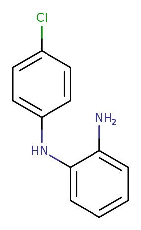
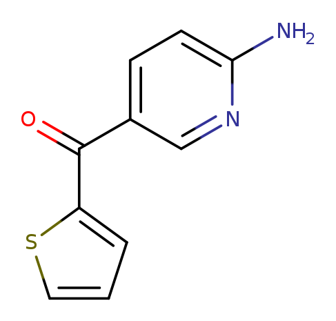

# Substructure Queries as Protos

As explained in [substructure](substructure.md) LillyMol
contains a great many concepts beyond simple atom mapping.
While a great deal can be expressed in a smarts, many
concepts are not related to any particular atom.

Refer to [why protos](why_protos.md) for why Protcol Buffers
are the preferred choice for specifying complex query conditions.

In all cases when dealing with protos, the definitive answer to
any question is to look at the proto definition file. For substructure
queries, that is [substructure.proto](/src/Molecule_Lib/substructure.proto).
If there is any divergence between what is written here and the proto file,
the proto file is right - since that is what the code is using.
The main proto used here is the `SubstructureSearch::SubstructureQuery`
proto.

For substructure searching, one or more queries are created as
text proto files and used by any of the tools that do substructure
searching.

## Usage
`tsubstructure` is the most common substructure searching use
case, although most tools that consume substructure queries use the
same functions, so this explanation applies to a great many tools.

To use a text proto file as a query in tsubstructure, use
```
tsubstructure -q PROTO:file1 -q PROTO:file2 ...
```

If you have many text proto query files, put the file names into another
file and use that.
```
ls *.textproto > all_queries
tsubstructure -q PROTOFILE:all_queries ...
```
Although seldom useful `tsubstructure` can also consume a text proto
directly on the command line
```
tsubstructure -q 'proto:query { smarts: "n" }' ...
```
For circumstances with a large number of queries, tools can consume
serialized `SubstructureSearch::SubstructureQuery` protos in a TFDataRecord
format via
```
tsubstructure -q TFPROTO:file ...
```
If there are a large number of queries, this is preferred.

## Examples.
While smarts are often used with `tsubstructure` via the `-s` or `-q S:...` options,
a smarts can also be the only part of a substructure query proto.
```
name: "aromatic nitrogen"
query {
  smarts: "n"
}
```
This would be the same as `-s n` when using `tsubstructure`. As such, the
proto offers no real advantage - although if this was part of a larger
series of proto queries they can all be consumed by `tsubstructure` via the
`-q PROTOFILE:all_queries` construct shown above

As mentioned in [substructure](substructure.md) a substructure query actually
consists of multiple individual queries, linked via logical operators. The
smarts `C||N` is actually equivalent to
```
query {
  smarts: "C"
}
query {
  smarts: "N"
}
```
there being an implied **or** operator between the two query components.
Similarly `C&&N` is the same as
```
query {
  smarts: "C"
}
query {
  smarts: "N"
}
logexp: SS_AND
```
where the queries are linked via an **and** operator rather than the
default **or** operator. Just as arbitrarily long expressions can be
constructed as smarts, so can they with protos. So `C&&N||F` is the same
as
```
query {
  smarts: "C"
}
query {
  smarts: "N"
}
query {
  smarts: "F"
}
logexp: SS_AND
logexp: SS_OR
```
which since in the proto definition file, logexp is a repeated field,
the last two lines can be written as
```
logexp: [SS_AND, SS_OR]
```

It is very important to note that the `smarts` directive in a
`query` block cannot contain logical operators. The `query` block
is an individual query. A collection of `query` blocks is a
composite query - which contains operators relating the individual
`query` objects.

For most of the rest of this document, composite queries such as the
above will not be discussed. But any of the single query component
ideas discussed below can be made part of a composite query.

Note that it is possible to create a very large composite query,
which might fulfull the role of having multiple queries in a file.
That is discouraged due to lack of ability to individually test
query components. Also on occasions when it has accidentially
happened, the performance seemed unfavourable, although not sure
about that.

## Query Match Specifications
Within a query object, many settings are available which govern
how the matching takes place. These are copied directly from
the proto definition file.

* optional bool one_embedding_per_start_atom = 4;
* optional uint32 normalise_rc_per_hits_needed = 5;
* optional uint32 subtract_from_rc = 6;
* optional uint32 max_matches_to_find = 8;
* optional bool embeddings_do_not_overlap = 15;
* optional bool sort_by_preference_value = 16;

* optional bool save_matched_atoms = 9;

In the [proto definition file](/src/Molecule_Lib/substructure.proto),
each of these is defined, so that is not repeated here (maybe one of
the automatic documentation generators would be interesting).

## Global Conditions
Individual queries can contain pre-conditions on molecules. For example, if 
your query requires two different aromatic rings, you can impose a
required molecular property of at least two aromatic rings. If the
molecule does not contain the requisite number, no atom matching is
attempted. This may help with efficiency.

The message describing these required properties is `SubstructureSearch::RequiredMolecularProperties`
and the documentation is found in the definition of that message. A typical usage might be

```
name: "Two furan-like oxygens"
query {
  required_molecular_properties {
    min_natoms: 30
    min_aromatic_rings: 2
    elements_needed {
      atomic_number: 8
      min_hits_needed: 2
    }
    elements_needed {
      atomic_symbol: "P"
      hits_needed: 0
    }
  }
  smarts: "[/IWrid1o].[/IWrid2o]"
}
```
While this was initially implemented as an efficiency tool, generally we find that it
does not make much of a difference on speed, but can be a very useful expressive
device.

Currently the following properties are supported, together with their min_ and max_ variations.
```
natoms
nrings
heteroatoms_in_molecule
fused_rings
strongly_fused_rings
isolated_rings
ring_systems
aromatic_rings
aromatic_atoms
non_aromatic_rings
number_isotopic_atoms
number_fragments
atoms_in_spinach
inter_ring_atoms
net_formal_charge
any_net_formal_charge
elements_needed
required_bond
```
More simple to compute properties could be added. It is a pre-match filter and there
is no connection between any of the atoms used to satisfy these criteria and
the subsequent atom matching.

For access to a more complete set of molecular properties, it may be useful to
use `iwdescr`.
```
iwdescr.sh -s . -F 'w_natoms<30' -F 'w_nrings<4' file.smi | tsubstructure.sh -s 'O' -
```
which should be functionally equivalent to many of the attributes specified
via required_molecular_properties.

### RequiredBond
The required_bond attribute of a required_molecular_properties message
allows specification of a particular bond somewhere in the molecule.
Since this is done via a scan over the bond list, rather than via
atom matching, it can help with efficiency.

```
required_bond {
  atomic_number_1: 6
  btype: SS_SINGLE_BOND
  atomic_number_2: 8
}
```
means that somewhere in the molecule there is a Carbon Oxygen
single bond. Again, there is no relationship between this bond any any
subsequent atom matching. This is just for efficiency.

## Ring Systems
One of the most common use cases for beyond smarts queries are queries
that involve specification of a ring system. In standard smarts it
would be difficult to express a concept like 'an Aniline like Nitrogen
attached to a 6 membered isolated aromatic ring with an electron withdrawing group'
By using a ring specifier message in a proto, we can do things like that.
```
name: "Aniline EWD"
query {
  ring_specifier {
    aromatic: true
    fused: 0
    base {
      environment: "a-[F,Cl]||a-N(=O)=O||a-C=O"
    }
  }
  smarts: "[ar6]-[ND1H2]"
}
```
This only matches molecules that contain an unfused aromatic ring, with at least
one electron withdrawing group.

The reason for the use of the `base` message for the environment is that there is
also ring system 
specifier, and it uses the same mechanism, so `base` is shared between them.

Unfortunately the query above matches molecules like


since there is no link between the ring that is matched and the smarts atom matching. Indeed
the molecule does contain the ring we describe, and it does contain an Aniline like
Nitrogen atom, but that was not the intent.
Like `required_molecular_properties`, the ring and ring system filtering is done prior to
atom matching.
The `global_id` concept is introduced to enable a linkage between the atoms matched
in a ring, or ring system specification and the subsequent matching of atoms.
```
name: "Aniline EWD"
query {
  ring_specifier {
    aromatic: true
    fused: 0
    base {
      environment: "a-[F,Cl]||a-N(=O)=O||a-C=O"
      set_global_id: 5
    }
  }
  smarts: "[/IWgid5a]-[ND1H2]"
}
```
Within the `base` message of the `ring_specifier` we set a global id of 5. All
atoms that comprise the ring match, are assigned that global id. Later in the
atom matching smarts, we specify that we want to match atoms that have been
assigned global id 5. Now we only get matches where the Amine is attached
to the same ring as the electron withdrawing groups.

Note that while we could have added `[ND1H2]` as another `environment` component,
that would still not establish a link to the matched atoms to be returned - needed
for a reaction for example.

Again, the `SubstructureRingSpecification` message contains several settable
attributes. In addition, properties can be specified via the `base` message
which is shared by the analogous `SubstructureRingSystemSpecification` which
specifies ring systems.

In this example, we specify exactly two connections to the ring, so there
can be the aniline and one other connection.
```
name: "Aniline EWD"
query {
  ring_specifier {
    aromatic: true
    fused: 0
    base {
      environment: "a-[F,Cl]||a-N(=O)=O||a-C=O"
      ncon: 2
      set_global_id: 5
    }
  }
  smarts: "[/IWgid5a]-[ND1H2]"
}
```
which results in matches like


where there are exactly two substitutions on the ring. Again, there are many different
base properties that can be specified, which are described in the proto definiton file.


# Substituents
While the environment is a convenient means of specifying what is joined to a ring
or ring system, the `Substituent` message contains more flexibility.

For example if one were looking for fused 6-6 aromatic bi-cycle, that had some specific
substituents - contains an amide, but not certain other groups.
```
name: "descriptive name"
query {
  ring_system_specifier {
    rings_in_system: 2
    aromatic_ring_count: 2
    ring_size_requirement {
      ring_size: 6
      count: 2
    }
    base {
      set_global_id: 1
      max_ncon: 4
      substituent {
        min_natoms: 3
        max_natoms: 12
        max_nrings: 1
        hits_needed: 1
        max_length: 8
        required_smarts: "[ND2H]-C(=O)[#6]"
        disqualifying_smarts: "[Cl,Br,I,OH]||O=N=O"
        set_global_id: 2
      }
    }
  }

  smarts: "[/IWgid1]!@[/IWgid2D2]"
}
```
The atom matching matches an atom in the ring system (which was assigned global id 1)
and an atom in the substituent (which was assigned global id 2).

Further levels of complexity can be added
```
name: ""
query {
  ring_system_specifier {
    rings_in_system: 2
    aromatic_ring_count: 2
    ring_size_requirement {
      ring_size: 6
      count: 2
    }
    base {
      set_global_id: 1
      min_heteroatom_count: 4
      substituent {
        min_natoms: 3
        max_natoms: 12
        max_nrings: 1
        hits_needed: 1
        max_length: 8
        required_smarts: "[ND2H]-C(=O)[#6]"
        disqualifying_smarts: "[Cl,Br,I,OH]||O=N=O"
        set_global_id: 2
      }
      environment: "a-[D1]&&0a-N(=O)=O"
    }
  }

  smarts: "[/IWgid1]!@[/IWgid2D2]"
}
```
Not saying this is a realistic example, but certainly individually each of these
conditions has been used.

Whether one uses a `ring_system_specifier` or `ring_specifier` will vary on the task
at hand.

## NoMatchedAtomsBetween
The `...{}` construct in smarts can also be specified in a proto with the `no_matched_atoms_between`
directive.
```
query {
  smarts: "[OH]-C(=O).c-C(=O)-[OH]"
  no_matched_atoms_between {
    a1: 1
    a2: 3
    qualifier: "{>6}"
  }
}
```
This can avoid problems where specifying multiple no matched atoms between directives
in a smiles becomes impossible.

## Region
A region is defined by two matched atoms. All atoms that are in the
contiguous region defined by these two atoms comprise the region.
Obviously if the two matched atoms
that define the region are in a ring, this will fail. But as long as
at least one of the atoms that define the region is in a chain, the
region can be defined.
We can specify various attributes of
such a region. This is a new functionality that has not been fully developed. The
initial application was to identify linker groups - all atoms between two rings,
but excluding those cases where there might be another ring.
```
query {
  smarts: "[D3R]-!@*...{<5;0[R]}*-!@[D3R]"
  region {
    atom: [1, 2]
    max_natoms: 12
    nrings: 0
  }
}
```
identifies molecules containing two separated rings, and in between those two rings
there is a region with at most 12 atoms and no rings. And of course more complex
conditions could be placed on the atoms in the smarts.

The concept of a between-ring group of atoms was later implemented via the
InterRingAtoms message, but the Region concept remained useful otherwise.

A common task in de-novo molecule generation is to try to replace a core
piece of a molecule. If that chunk is a linker group between two rings,
the tool `get_linkers` can be used. It is designed for this task,
although currently of somewhat limited functionality.

But the region functionality within substructure searching might offer
certain flexibilities. Imagine we need to replace a region of a molecule
that is between two six membered aromatic rings. We have a constraint
that the number of bonds between the two groups must remain between 5 and
7 bonds. In addition, the replacement group can have a max of 1 ring,
and have no more than 2 atoms that are not on the shortest path between
the join points - not too much branching.

A query that can do that might be
```
query {
  smarts: "a-!@*...{3-5}*-!@a"
  unique_embeddings_only: true
  region {
    atom: [1, 2]
    max_nrings: 1
    max_atoms_not_on_shortest_path: 2
  }
}
```
This will match groups of atoms that are
. in between two aromatic rings.
. contain a max of 1 ring
. have a max of 2 atoms that are *not* on the shortest path.

Fragments matching this query might be attractive candidates for
replacing a region in a molecule.

Currently only
. natoms
. nrings
. atoms_not_on_shortest_path
are implemented.  When or if other needs are identified, the `region` concept can be expanded.

## LinkAtoms
The `NoMatchedAtomsBetween` idea is related to the idea of link atoms, but
as implemented, link atoms can pass through matched atoms. It is implemented
by computing the shortest distance bond between the two atoms, without
regard to any other matched atoms.
```
query {
  smarts: "[NH>0].O=c"
  link_atoms {
    a1: 0
    a2: 1
    max_distance: 8
  }
}
```

## DownTheBond
The down the bond construct in smarts `[Cx>0]-!@<4a}N` is implemented in the proto as
```
query {
  smarts: "[Cx>0]-N"
  down_the_bond {
    a1: 0
    a2: 1
    max_natoms: 3
  }
}
```
There is strong conceptual overlap between the `DownTheBond` idea and the `Substituent` idea
and they should probably be merged.

## SubstructureEnvironment
We have already seen that ring and ring system specifiers had the concept of an
environment - a requirement that needed to be satisfied somewhere on a group of ring
atoms. This concept extends to matched atoms in the query. We can have environments
that are requried for a match, or environments, which if present, cause matching
to fail. The atoms in the environment are not returned to the caller as matched
query atoms.

For example, in looking for likely charged amines, that query might look like
```
query {
  smarts: "[ND<4G0T0]"
  environment_no_match {
    attachment {
      attachment_point: 0
      btype: SS_SINGLE_BOND
    }
    smarts: "a"
    smarts: "[G>0]"
    smarts: "[+]"
    smarts: "C-[+]"
    smarts: "C-C-[+]"
    smarts: "C-[O,F,P,S,Cl,Br,I]"
  }
}
```
Rather than making a complex recursive smarts with all these exclusions built in
the proto representation is easier to understand and maintain.

Note that when environments were specified for rings and ring systems, the first
atom in the environments query was an atom in the ring. These kinds of environments
are different, with the first query atom being an unmatched atom.

Generally environment atoms only match unmatched atoms, although that can be changed with
the `environment_must_match_unmatched_atoms` directive - which defaults to true.

The `attachment_point` attribute is a repeated field, so we can specify an environment
to be at any matched atom. To look for an aniline like Nitrogen with an ortho or para
halogen, that might be
```
query {
  smarts: "[ND1H2][/IWfsid1ar6]:a:a:a"
  environment {
    attachment {
      attachment_point: [2, 4]
      btype: SS_SINGLE_BOND
    }
    smarts: "[Cl,Br,I]"
  }
}
```
If there are multiple environments specified, all of them must match. For
flexibility an environment can have an `and_id` or `or_id` attribute
which can be used to create more complex logic. It would be better
to use the more general logical operator construct used elsewhere.

## MatchedAtomMatch
This is a newly added feature which is mostly a means of avoiding
needlessly complex smarts. It is similar in functioning to environments, but
starts with a matched atom.

For example, if we wanted a matched carbon atom to be either [CH3] or to extend to a
CF3, OH or OCH3, that can be specified as
```
query {
  smarts: "[Cx0]"
  matched_atom_must_be {
    atom: 0
    smarts: "[CH3]"
    smarts: "[CD2]-[OH]"
    smarts: "[CD2]-C(F)(F)F"
    smarts: "[CD2]-O-[CD1]"
  }
}
```
Perhaps this query could be done with an `environment`, but I am not sure. What makes
it hard is the possibility of there being no substituent at all.

An example with a lot of negative exclusions might be a primary amine.
```
query {
  smarts: "[ND1H2]"
  matched_atom_must_be {
    atom: 0
    smarts: "!N-C=O"
    smarts: "!N-S=O"
    smarts: "!N-C=S"
    smarts: "!N-C=S"
    smarts: "!N-a"
    smarts: "!N-[!#6]"
    smarts: "!N...{<3}N"
  }
}
```
Again, this could all be accomplished with a fairly gruesome recursive smarts, or an
`environment_no_match`, this
construct is just a notational convenience. And of course the original smarts can
have arbitrary complexity as well, so there is considerable flexibility here.

## Nearby Atoms
When working with lead optimisation projects there may be some fairly non
specific requirements to be investigated. For example 'an x kind of ring,
and within two bonds we need both a donor and an acceptor'. Or 'from this
point on the aromatic ring, we need a primary amine within 2 bonds'. Or 
'no nitro group within 2 bonds of the ring'.

The NearbyAtoms concept was introduced to enable these kinds of minimally
specified query types. A fairly complex example might be
```
query {
  ring_system_specifier {
    rings_in_system: 2
    aromatic_ring_count: 2
    base {
      min_heteroatom_count: 1
      set_global_id: 1
      environment: "[o,nD2H0]&&[cD3]-!@*"
    }
  }

  smarts: "[/IWgid1]"

  nearby_atoms {
    smarts: "[OH,SH]"
    max_bonds_between: 3
    hits_needed: 1
  }
  nearby_atoms {
    smarts: "[ND1H2T0]-[G0]"
    max_bonds_between: 2
    rejection: true
  }
}
```
which matches a

* two-aromatic-ring ring system with at least one heteroatom
* somewhere in that ring system is an acceptor
* somewhere in the ring system there is a 3 connected carbon with a non ring bond
* the smarts defines all atoms in that ring system
* within 3 bonds of a ring atom, there must be exactly one OH or SH
* fail if there is a primary amine within 2 bonds of the ring.

The first condition is already covered by the second matching criterion, and
so is not strictly necessary.

The smarts matches all atoms in the ring system, and so the required OH or SH
can be anywhere near the ring system.

You can also restrict the nearby atoms matches to specific matched atoms by use
of the matched_atom directive. But note the potential overlap with the
`link_atoms` directive. By default, the atoms in the nearby_atoms block
must be distinct from the matched atoms, but that can be changed if
`can_overlap_matched_atoms` is set.

If there are no constraints on distance, then a simple '&&' smarts can be
used, which describes two (possibly overlapping) separate smarts matches.

## Smarts
I have heard smarts referred to as a 'write only' language. Several of these
constructs in the proto representation are specifically designed to lessen the
need for complex recursive smarts.

That said, as part of this distribution, you will find the `mkbenzene.py` which
creates recursive smarts of arbitrary depth. Enjoy...

## Conclusion
Protocol Buffers enable the expression of fairly complex substructure
searching concepts. But after working with these tools for many years,
we are still encountering quite reasonable substructure query ideas that
cannot be processed readily. There will be an ongoing effort to decide
which of those unmet needs are worth addressing in LillyMol.
