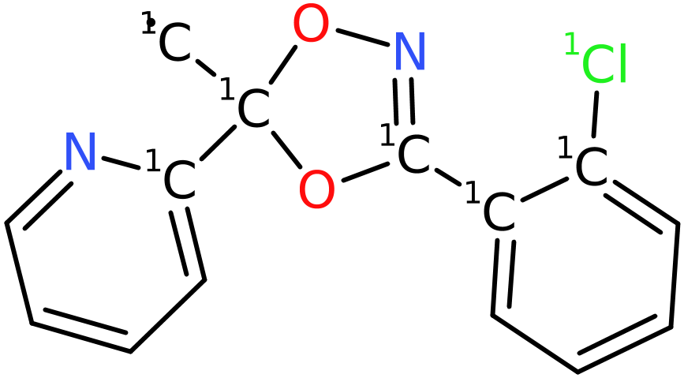
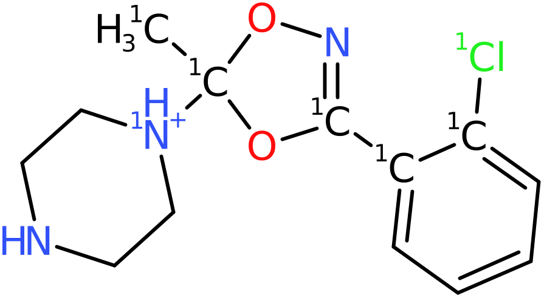

# SAFE

The idea for the SAFE smiles representation was proposed by 
```
Gotta be SAFE: A New Framework for Molecular Design
Emanuel Noutahi, Christian Gabellini, Michael Craig
Jonathan Lim, Prudencio Tosou. Valence Labs.
https://arxiv.org/pdf/2310.10773.pdf
```
and LillyMol has a tool, `mol2SAFE` that can convert a normal
smiles file to a SAFE type smiles file.

A typical SAFE smiles might look something like
```
[1C]%10.[1C]%11.[1O]%10%12.[1N]%13(=O)=O.[1C]%131=[1C]%11C2=C(O1)C=[1C]%12C=C2 CHEMBL7372
[1O]%10.[1O]%11.[1O]%12.[1O]%13.[1C]%10%14.O1[1C]%14[1C]%11CO[1P]%12(=O)O[1P]%131=O CHEMBL1162462
[1N]%10%11%12.[1C]%12.[1C]%13%10.[1C]%13#C.[1C]%11(C)[1C]%14.[1C]%141=CC=CC=C1 CHEMBL8663
[1C]%10%11.[1N]%12%10.N#[1C]%13.[1C]%12CC.[1C]%131=CC=C[1C]%11=C1 CHEMBL14007
[1C]%10.[1C]%11.[1O]%12[1S]%10(=O)=O.[1N]%121C(=O)[1C]%11CC1=O CHEMBL11688
[1Cl]%10.[1Cl]%11.[1C]%12%13.[1N]%14%12.[1C]%14C.[1C]%101=[1C]%13C=C[1C]%11=C1 CHEMBL13547
[1N]%10%11.[1Cl]%12.[1Cl]%13.[1C]%11%14.[1C]%10C.[1C]%141=[1C]%12C=C[1C]%13=C1 CHEMBL13562
```
where `%nn` ring opening and closing features have been added in order
to rebuild the molecule.

## De-Novo Generation
There are two modes of operation:

1. Replace a SAFE fragment with a fragment from a library.
2. Replace a SAFE fragment with a fragment from another molecule.

Both involve first running mol2SAFE in order
to generate the SAFE representations.

During testing, the following invocation seemed useful.
```
mol2SAFE -v -c -l -I 1 -S Sfile -M 16 -M maxnr=9 -g all -z -T I=Cl -T Br=Cl chembl.smi > chembl.safe.smi
```
Takes less than 3 minutes to process a recent version of Chembl.

The usage message for mol2SAFE is
```
Transform smiles to SAFE representations.
 -p             write the parent molecule as well
 -c             remove chirality
 -l             strip to largest fragment
 -y             re-use ring numbers in generated ring numbers
 -I <iso>       place a fixed isotope on all attachment points
 -P <atype>     atom typing specification. If specified the isotope will be the atom type.
 -S <fname>     write fragment statistics in dicer_data::DicerFragment textproto form
 -M ...         constraints on max fragment size
 -M <n>         fragments can contain no more than <n> atoms
 -M maxnr=<n>   the maximum number of non-ring atoms that can be in a fragment
 -g ...         standardisation options
 -z             ignore connection table errors on input
 -T ...         Element transformations - suggest '-T Br=Cl -T I=Cl'
 -t             test the unique smiles of the parent against that formed from the SAFE representation.
                This only works if chirality is removed and isotopes NOT added.
 -v             verbose output
```

In the invocation above, input is stripped to the largest fragment, chirality is removed,
chemical standardisation is applied, and a common Halogen transformation is applied. We
limit ourselves to fragments with a maximum of 16 heavy atoms, of which a max of 9 can be
non ring atoms.

The file `Sfile` is a textproto file with a summary of the fragments found. This file can be
used as input as a library file (-L option) to `safe_generate`. For Chembl, it contains about 91k molecules.

In a lead optimisation scenario, it would make sense to use to build a fragment library
from active molecules, and then feed all active molecules to safe_generate in order to
generate molecules where likely active fragments get combined across product
molecules.

## safe_generate
Once a SAFE fragment library file has been built, and/or the input set of molecules
converted to SAFE form, safe_generate can be run. Configuration via a textproto config
file is preferred.
```
safe_generate -b 20000 -p -n 1000 -C generate.textproto -v -L Sfile input.smi
```
For each input file, use fragment replacements from the Library file (-L) to generate
up to 1000 new molecules for each input molecule. In addition,
randomly choose pairs of molecules from within `input.smi`
to breed, by swapping compatible fragments, generating a maximum of 20k new molecules.

The textproto config file might look like
```
etrans {
  etrans {
    efrom: "I"
    eto: "Cl"
  }
  etrans {
    efrom: "Br"
    eto: "Cl"
  }
}

max_atoms_in_fragment: 10
extra_atoms: 2
fewer_atoms: 2
extra_rings: 1
max_formula_difference: 3
molecule_filter {
  max_natoms: 40
  max_nrings: 5
  max_rotatable_bonds: 10
  min_aromatic_ring_count: 1
  max_aliphatic_ring_count: 2
}
```
The first part describes two elemental transformations: translate I to Cl, and Br to Cl.

Only fragments with at most 10 atoms will be processed. Once a fragment is selected for
replacement, the library fragment, or fragment chosen from another molecule, must differ
by at most two atoms. Additionally, the new fragment can have an extra ring - but this
might be hard with only two additional atoms. These two parameters are related.

Note that if both `extra_atoms` and `fewer_atoms` are **not** specified, then replacement
fragments must be the same size as what is being removed.

The `max_formula_difference` specification is unusual. An aromatic molecular formula
is computed for each fragment: it contains the number of aliphatic Carbon and aromatic
Carbon atoms, etc. In order for a fragment swap to uccur, the total absolute difference in 
the two formulae must be 3 or fewer.

Then follows specification of the molecule filter that is applied to the product
molecules before writing.

Given an input file with 200 molecules, the invocation above generates
almost 50k molecules in 36 seconds.

There is no recursion built into safe_generate, but if SAFE smiles are written,
-s, then the output from onvocation can be fed to another, which has the
advantage of seamlessly using multiple cores. But since the two processes are
separate, duplicate detection is not robust. Adding recursion would add
code complexity, and is not a priority now.

## Examples
Given

 

and CHEMBL493334, the molecule



can be formed with the config file above. In this case
the transformation is rather simple, an aromatic ring
swapped for an aliphatic ring of the same size, but many more
possibilities are available - that molecule generated over
200 different variants, consistent with the configuration file.

## Summary
`safe_generate` can reasonably quickly generate quite reasonable
looking molecules. It is highly likely that the results would need
to be sent to some kind of post-processing filtering - Lilly Medchem
Rules for example. And/or set query specifications in the
`discard_if_match` attribute in the config file in order to specify
specific queries specifying product molecules to be discarded. Note
that it takes the same syntax as the -q option to `tsubstructure`
so an entry like
```
  discard_if_match: "SMARTS:[CH]=O"
```
could be used to discard aldehydes in products - some care has been taken to
minimise this, but some do make their way through.

There is no correct specification for the entries in the config file.
Allowing only small differences will result in a 'conservative' set
of new molecules, where the differences from the starting molecules
are small. Large values will see more diverse molecules generated.
Conservative changes should maximise the ability of a QSAR model
to make valid predictions.

