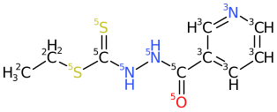

# Dicer

Dicer is a tool that breaks bonds in molecules, generating fragments.

This can be useful when looking for "privileged frgaments" within a
dataset.

Dicer starts by examining the bonds in the molecule, and deciding which ones
can be broken. Generally, ring and multiple bonds will NOT be broken, although the 
precise behavior can be changed via command line options.

Dicer generates **all** fragments, including overlapping, although it can
be run in a way that mimics recap, without overlapping fragments.

## Execution

While dicer can be run with no arguments, and will generate output
it is likely most useful with various options.

### Scalability
In large molecules, with many breakable bonds, large numbers of fragments can be
generated, and this is unlikely to be useful. It is generally desirable, or
even necessary to limit the amount of fragmentation that dicer performs. There
are a number of means of doing this.

The `-X` option allows control of the number of fragments generated by any
molecule.  This is periodically checked during fragment generation, so the
actual number of fragments generated will likely exceed the limit.

For example, CHEMBL4524052 contains 636 atoms and 360 rotatable bonds. If dicer
is allowed to process this with no constraints, after 3 hours of processing
it has generated 85k fragments, with no real indication of how much remains.
After 13 hours it had generated 170k fragments. After 5 days it has generated
520k fragments. After 7 days it generated 595k fragments. After 13 days it had
generated 690k fragments. After 21 days it had generated 715k fragments. After
23 days it had generated 825k fragments.

Enable this periodic reporting with `-B freport=10000` to have it report every 10k 
fragments formed for any particular molecule.

The `-k` option, the number of bonds that can be simultaneously broken,
can also be used to limit how much fragmentation an individual
molecule can undergo. The default is 10, which will be quite unsuitable for
molecules with large numbers of rotatable bonds. Allowing 3 simultaneous bond
breakages may be a reasonable compromise. For example our large Chembl molecule
CHEMBL4524052 takes 30 minutes to generate 6.5k fragments if run with the `-k 3`
option. This is of course a completely unreasonable run-time for a single
molecule, but it does show how this option can limit the work performed.

Generally large molecules with many rotatable bonds are best excluded from dicer
processing since the sheer number of fragments generated by this one molecule
can dominate a dataset. Also, for reasonably sized fragments, they will likely
be found in smaller molecules - if the task is fragment discovery.

On reasonably sized molecules dicer is probably fast enough.  On 1000 random
molecules from Chembl, with an average of 28 heavy atoms, `dicer -k 3` runs in
2.3 seconds, generating 65k fragments. If the fragments are restricted in size
(see below) to `-m 5 -M 15` only 21k fragments are generated, but run time drops
to 0.7 seconds.

### Breakable Bonds
Dicer has internal rules for which bonds can be broken.  Generally those are
single, non-ring bonds. By default `C-C` bonds are not broken. 
The choice of which bonds are broken can be over-ridden at run time via the `-s`, `-q`,
`-n` and `-N` options.

The `-s` and `-q` options allow specifying smarts or query files that designate
bonds which are to be broken. The `-n` and `-N` options allow specification of
bonds that cannot be broken.

By default, the `-s` and `-q` options replace the existing list of breakable
bonds, but with the `-B addq` option combination, they are added. This might
be useful if you wish to add ring breaking queries. Note that the first two
matched atoms in the query define the bond. Note also that the -B option has
directives for enabling fused ring breakages.

So, if you only wanted to break at aromatic rings,

dicer `-s 'a-!@*'` would do that, or rings in general `-s '[R]-!@*'`

The one historical oversight is that by default, dicer will break amide bonds,
which is probably undesirable. Change this by adding `-B nbamide` to the
invocation.

Also by default, dicer will not break a carbon-carbon bond where one, or both,
are in a ring. Add `-B brcb` to break all ring-chain bonds.

### Fragment Size.
Another way of limiting what dicer does is to impose limits on the size of
fragments that can be produced. The `-m` and `-M` options allow specifying
a lower and an upper atom count for fragments produced. Unfortunately
the fragments are generated and then checked for violations, which is not
efficient. Work is under way to fix this.

With the -M option, you can modify the behaviour to take account of 
non ring atoms. For example, you might want `-M` to be fairly large,
say 16, so you capture some interesting ring system. But you don't
want a 16 atom fragment with no rings. Modify the -M option with
`-M 16 -M maxnr=5` which imposes a cutoff of 16 atoms, while also
discarding anything with more than 5 non ring atoms.

Within the -B option (see below) there are options for selecting
fragments based on what fraction of the whole molecule they comprise.

### Chirality
Chirality may not be useful, and it can be removed with the `-c` option.

### Element Transformations.
Experience tells us that differentiating I, Cl, and Br is seldom useful in an SAR. The
-T option enables element transformations that element conversions on the input.
Add `-T I=Cl -T Br=Cl` to translate all heavy halogens to `Cl`.

### Atom Typing
Dicer fragmentation can be very useful in *de-novo* molecule construction and
atom types can be assigned and saved with the fragments. See also the discussion
of isotopes below, since atom types are most commonly instantiated as isotopic
labels.

### The `-B` option.

As dicer evolved, it was called upon to do more and more things, and the
number of optional behaviours became quite unwieldy. It should be re-cast to
operate from a Protocol Buffer file, and that may happen. In order to deal
with the abundance of functionality, a variety of optional behaviors are
bundled in the `-B` option. Enter `-B help` for a list of those.

A more complete explanation of those sub-options follows.


#### atype=\<tag\>
Calculate atom type and dump it in frag/comp pairs
#### term
Perceive terminal groups. By default, single atom terminal groups are
not produced.
#### bscb
Allow Carbon-Carbon chain single bonds to break. By default, these are not broken.
#### xsub
Do not report fragments that are exact subsets of others. This does not work
very well, and always causes run-time problems. Best to not use.
#### nosmi
Suppress output of fragment smiles.
#### noparent
Suppress output of parent smiles.
#### time
Run timing.
#### addq
Run the -q queries in addition to the default rules.
#### WB=fname
Write smiles of just broken molecules to \<fname\>.
#### BRB
Break some kinds of cross ring bond pairs
#### BRF
Break fused rings. Generally bonds in rings are not broken. The bonds that are broken are the bonds
adjacent to the ring fusion. If this destroys aromaticity the bonds on that side will not be broken.
#### BRS
Break spiro rings. By default, these are not broken.
#### BBRK_FILE=\<fname\>
Write bonds to break to \<fname\> - no computation. Writes a .sdf file with the atom
numbers of the breakable bonds written in a tag. Use case lost in history.
#### BBRK_TAG=\<tag\>
Read bonds to be broken from sdf tag \<tag\> (def DICER_BBRK).  Use case lost in history.
#### nousmi
Do **NOT** index fragments by their unique smiles. This is very dangerous, because it
disables uniqueness detection, and means that any `fragstat` operation is invalidated.
Where it is useful is if you start with molecules that have atom map numbers applied.
That way, the fragments generated will retain those atom map numbers, thereby enabling
a ready translation back to the starting molecule.
#### nbamide
Do NOT break amide and amide-like bonds.
#### nbfts
**This is currently not working properly, do not use.**
Do NOT break bonds that would yield fragments too small. This is generally a good idea for
performance - should be a default.
#### appnatoms
Append the atom count to each fragment produced
#### MAXAL=\<n\>
Max atoms lost when creating any fragment
#### MINFF=\<f\>
Discard fragments that comprise less than \<f\> fraction of atoms in parent
#### MAXFF=\<f\>
Discard fragments that comprise more than \<f\> fraction of atoms in parent
#### fragstat=\<fname\>
Write fragment statistics to \<fname\>. This is an important file that gives
counts of how often each fragment occurs in the dataset.
#### fstsp=\<float\>
Fractional support level for inclusion in fragstat= file. Fragments that occur
only occasionally in the input are likely not of great interest, suppress them
with this directive. There is no option for suppressing common fragments.
#### FMC:\<qry\>
Queries that fragments reported must contain. If you are interested only in
fragments that contain a particular functional group,
```
dicer -B FMC:SMARTS:F-a
```
will only generate fragments that contain an aromatic Fluorine.
#### FMC:heteroatom
fragments reported must contain a heteroatom, :n for count
```
dicer -B FMC:heteroatom:2 ...
```
will only write fragments that contain at least two heteroatoms. The same
thing could be obtained via
```
dicer -B FMC:SMARTS:>1[!#6]' ...
```
The `heteroatom` option seems un-necessary, don't use it.
#### VF=\<n\>
Output will be viewed in `vf` with \<n\> structures per page. `vf` is an
interactive structure viewer for viewing structures at the Linux command line.
If given this option dicer writes the parent molecule so it can appear to the
top left of each page of structures.
#### flush
Flush output after each molecule.
#### lostchiral
Check each fragment for lost chirality. Generally chirality should be discarded
with the `-c` option. With bonds being broken, chirality will almost certainly be
destroyed.
#### recap
work like Recap - break all breakable bonds at once
#### freport=\<n\>
report fragment creation every \<n\> fragments for a molecule

# Output
Frequently fragment output is most useful if there is a record of how the
fragment is embedded in the parent. Isotopic atoms can be placed at the join
points with the `-I` option, select a number for the isotope to use, `-I 1` for
example.

If given aspirin
```
dicer -m 3 -M 10 -v /home/ian/aspirin.smi
```
dicer will produce
```
CC(=O)OC1=CC=CC=C1C(=O)O aspirin B=5
O=C(C)Oc1ccccc1 aspirin FRAGID=10 N= 1
O=C(O)C aspirin FRAGID=9 N= 1
O=CC aspirin FRAGID=8 N= 1
O=COc1ccccc1 aspirin FRAGID=7 N= 1
O=Cc1c(O)cccc1 aspirin FRAGID=6 N= 1
Oc1ccccc1 aspirin FRAGID=5 N= 1
O=Cc1ccccc1 aspirin FRAGID=4 N= 1
O=CO aspirin FRAGID=3 N= 2
c1ccccc1 aspirin FRAGID=2 N= 1
O=C(O)c1ccccc1 aspirin FRAGID=1 N= 1
O=C(O)c1c(O)cccc1 aspirin FRAGID=0 N= 1

```
Each parent molecule record will end with B=\<n\> where \<n\> is the number of
rotatable bonds in the molecule, and then follow the fragments generated by
that parent.

With the `-I` option, it will place an isotope on the attachment points
```
dicer -m 3 -M 10 -I 1 -v /home/ian/aspirin.smi
```
```
CC(=O)OC1=CC=CC=C1C(=O)O aspirin B=5
O=C(Oc1[1cH]cccc1)C aspirin FRAGID=11 N= 1
[1OH]C(=O)C aspirin FRAGID=10 N= 1
O=[1CH]C aspirin FRAGID=9 N= 1
O=[1CH]Oc1[1cH]cccc1 aspirin FRAGID=8 N= 1
[1OH][1CH]=O aspirin FRAGID=7 N= 1
[1OH]c1c([1CH]=O)cccc1 aspirin FRAGID=6 N= 1
[1OH]c1[1cH]cccc1 aspirin FRAGID=5 N= 1
O=[1CH]c1[1cH]cccc1 aspirin FRAGID=4 N= 1
O[1CH]=O aspirin FRAGID=3 N= 1
[1cH]1[1cH]cccc1 aspirin FRAGID=2 N= 1
OC(=O)c1[1cH]cccc1 aspirin FRAGID=1 N= 1
[1OH]c1c(C(=O)O)cccc1 aspirin FRAGID=0 N= 1
```

### Zfile
The `-Z` option writes fully split molecules to that file. Note however that
this can be time consuming.

```
dicer -m 3 -M 10 -Z zfile.smi -v file.smi
```
will create `zfile.smi` that contains each molecule with all breakable
bonds simultaneously broken. Isotopic labels are not applied - will fix...

Here is an invocation that exercises a lot of options.
```
dicer -B nbfts -B nbamide -B 'FMC:SMARTS:2[#7H0]' -B fragstat=fragstat.smi -B fstsp=0.01
   -X 500 -k 3 -Z zfile.smi -m 5 -M 15 ~/rand.smi
```

### Complementary Fragments
The `-C` option writes extra records to the output that are fragments and their complements. 

TODO:ianwatson some examples of this.

## Isotopic Labels
A variety of isotopic labels can be applied to the generated fragments. The
help message generated by `dicer -I help` is

```
 -I env           atoms get isotopic labels according to their environment
 -I enva          specific atoms are added to indicate the environment
 When the 'env' or 'enva' directives are used, these isotopes or elements are added
 Descripton               iso element
 Terminal                 1   Te
 Aromatic                 2   Ar
 SaturatedCarbon          3   Cs
 SaturatedNitrogen        4   Nh
 SaturatedOxygen          5   Os
 UnsaturatedCarbon        6   Cu
 UnsaturatedNitrogen      7   Cu
 UnsaturatedOxygen        8   Cu
 AmideCarbon              9   Ac
 AmideNitrogen           10   Am
 Halogen                 11   Hg
 Nitro                   12   No
 RingCarbonAliphatic     13   Cr
 RingNitrogenAliphatic   14   Na
 -I atype         atoms labelled by atom type specified via the -P option.
                  Note that atom typing is performed on the starting molecule - before any bonds are broken.
 -I z             atoms labelled by atomic number of neighbour
 -I ini           atoms labelled by initial atom number (debugging uses)
 -I <number>      constant isotopic label applied to all join points
 -I inc=<n>       increment existing isotopic label before labelling join points
```

The simplist form is to use a single number, which puts an isotopic label on
each attachment, `-I 1` for example. This is the most common use.

Other uses of isotopes can provide context on how the fragment was embedded in
the starting molecule. For example `-I z` will set the isotope of the fragment
atom to be the atomic number of the atom at the other end of the last bond broken
when the fragment was formed. Note that this may end up being a somewhat arbitrary choice.
For example, if a fragment is attached to both an Oxygen substituent and a Carbon
substituent, you will likely get two variants of the fragment, one with a 6
isotope, and the other with isotope 8 on the attachment point.

The `env` and `enva` options are more complex. Rather than set an isotope
that is just the atomic number of what was previously attached, now some
rudimentary atom typing is performed. The types are listed in the table 
above. It is not clear if this current choice of atom types is optimal, and
I am definitely open to modifications. 

Dicer can also use any atom typing available via the -P option to set isotopes.
Perhaps the most useful will be the `-P EXT:...` option, which allows you
to specify an external set of queries that define each molecular feature.
See the atom_typing documentation [link](../Molecule_Lib/atom_typing.md).

A typical invocation might look like
```
dicer -I atype -P EXT:/path/to/external.textproto ... file.smi
```
which will identify functional groups via the external queries, and
apply the numeric value associated with each group to the attachment
point - to the atom that used to be attached to an atom in such a
group.

The `-I env` option applies isotopes to the remaining atom. The `-I enva`
directive results in an additional atom being added, with the elements
used listed in the table above. It is not clear that this offers any
advantage over isotopic labels, and those should be preferred.

# Dicer Related Tools
The output from dicer has many uses and several tools have been implemented
to consume the output from dicer. While some of these tools support the 
legacy output format, new tools will only support the proto output, either
as textproto or as TFDataRecord serialized protos.

The `-B fragstat=` option generates data which can be used for a variety
of purposes. Typical records in that file might look like
```
iso: ATT smi: "[1OH]C(=O)c1[1cH]scc1NC(=O)C" par: "CHEMBL1501251" nat: 12 n: 1
iso: ATT smi: "Clc1ccc(C=Cc2[1nH]c([1SH])[n][n]2)cc1" par: "CHEMBL2315802" nat: 15 n: 1
iso: ATT smi: "O[1BH]C(NC(=O)Cc1[n]ccc[n]1)[1CH3]" par: "CHEMBL5190088" nat: 14 n: 1
iso: ATT smi: "O=c1[nH]c2c(c(N(CC)C)[n]1)cc[1cH]c2" par: "CHEMBL5082697" nat: 15 n: 1
iso: ATT smi: "O=C(OC(C)C)C[1NH][1CH3]" par: "CHEMBL21367" nat: 9 n: 1
iso: ATT smi: "Cc1cc(SCC2N[1CH2][1CH2][1CH2]2)ccc1" par: "CHEMBL542449" nat: 14 n: 2
iso: ATT smi: "N#Cc1c(cc(C[1CH2]C)c(c1)OC)OC" par: "CHEMBL8336" nat: 15 n: 2
iso: ATT smi: "OCC(NC1CC[1NH]CC1)c1occc1" par: "CHEMBL4524640" nat: 15 n: 2
iso: ATT smi: "Clc1[n](c([n+]([1cH]1)C[1CH]=O)C)C" par: "CHEMBL2334991" nat: 11 n: 4
iso: ATT smi: "[1OH]c1cc(C2N(N=[1CH]C2)[1CH]=O)ccc1" par: "CHEMBL392276" nat: 14 n: 12

aiso: ATT smi: "O[1CH]=O" par: "CHEMBL503643" nat: 3 n: 191448
iso: ATT smi: "[1cH]1[1cH]cccc1" par: "CHEMBL500202" nat: 6 n: 191895
iso: ATT smi: "[1OH][1CH]=O" par: "CHEMBL503643" nat: 3 n: 215177
iso: ATT smi: "c1[1cH]ccc[1cH]1" par: "CHEMBL501671" nat: 6 n: 230309
iso: ATT smi: "[1cH]1c[1cH][1cH]cc1" par: "CHEMBL265174" nat: 6 n: 332008
iso: ATT smi: "[1cH]1ccccc1" par: "CHEMBL503870" nat: 6 n: 453393
iso: ATT smi: "[1cH]1cc[1cH]cc1" par: "CHEMBL503634" nat: 6 n: 661905
iso: ATT smi: "O=[1CH][1NH2]" par: "CHEMBL503870" nat: 3 n: 725590
```
In these smiles we see a mixture of smiles with one and two isotopes.
Smiles with one isotope are substituents. Smiles with two isotopic atoms
are linkers, and smiles with three isotopes were excised by breaking three
bonds.

The one and two isotope variants are the most useful for de-novo molecule
creation.

If you want to do a substituent replacement, start with the fragments with
one isotopic label. Filter those fragments with tools like fileconv, to limit
them to the target number of atoms, or rings, and use tsubstructure to enforce
substructural requirements or exclusions.

For example if we require substituents with a primary amine, but no amides that
might look like

```
tsubstructure -i textproto -s '1[1]' -m - collection.textproto |
  tsubstructure -s '[NH2D2](-[CX4])-[CX4]' -i smi -m - - |
  tsubstructure -s 'O=C-N' -n - -i smi -
```
can do that. The first tsubstructure invocation filters to molecules with
just one isotopic atom. The second filters to molecules containing a primary
amine, writing to the `-m` output, and the third one looks for an amide, and
writes the non matches to the `-n` stream.

Note that this could also have been done with a single invocation
```
tsubstructure -i textproto -s '1[1]' -s '[NH2D2](-[CX4])-[CX4]' -s '0O=C-N' 
        -M mmaq -m - collection.textproto
```
All queries are specified, including zero occurrences of an amide. The
`-M mmaq` directive says that in order for a match to occur, all the queries
must match - the default behaviour in tsubstructure is that if any of the
queries specified matches, then a match is recorded.

This could be further compressed to
```
tsubstructure -s '1[1]&&[NH2D2](-[CX4])-[CX4]&&0O=C-N' ...
```
which combines all the separate queries into one. But readability suffers.
All generate the same result, with the first and last being the most efficient.

You can filter by atom count, or number of rings with fileconv
```
fileconv -C 10 -r 1 -R S:1 -S ok -v -i textproto collection.fragstat
```
will limit fragments to a max of 10 heavy atoms. The `-r 1` option means
the fragment must have at least one ring, and `-R S:1` discards any
fragment with more than 1 ring system. This allows a single, possibly fused system
only.

In a sidechain replacement you can limit the maximum distance from the 
attachment point by looking for molecules that have an atom that is
too far away. For example to discard fragments where the longest distance
from the attachment point does not exceed 5 bonds, try
```
tsubstructure -s '[1]...{>5}*' -n ok -i textproto -v collection.fragstat
```
If a molecule matches this query, then it is too long, more than 5 atoms
from the attachment point, so matches are bad. We capture the non matches
via the `-n` option, which are those molecules where all the atoms are
5 atoms or less from the attachment point.

Once a suitable set of sidechain replacements has been assembled, adding
them to another molecule is usually straightforward due to the isotopic
label. If the addition site also has an isotopic label, the reaction might
be.
```
scaffold {
  id: 0
  smarts: "[1]"
}
sidechain {
  id: 1
  smarts: "[1]"
  join {
    a1: 0
    a2: 0
  }
}
```
Or if we were trying to replace the N side of an amide group, we might
look for fragments containing
```
-s '[1N]'
```
the attachment is an isotopically labelled Nitrogen atom. In the existing
molecule we need to break the amide bond and discard the existing "right hand side"
before pasting in our replacement.
```
scaffold {
  smarts: "O=C-N"
  break_bond {
    a1: 1
    a2: 2
  }
  remove_fragment: 2
}
sidechain {
  smarts: "[1N]"
  join {
    a1: 1
    a2: 0
  }
}
```
will see the existing N side of the amide removed, and replaced by the fragments from
dicer.

One of the things that is attractive about this approach is that because the fragments
are all extracted from existing, and possibly well precedented molecules, there
should be an elevated chance of the resulting molecules being synthetically viable.
Definitely not guaranteed, but increased probability. For more precise and
controlled replacements, see [get_substituents](/docs/Molecule_Tools/get_substituents.md)
which allows fine grain control of the environment from which a fragment is extracted.

## Replacing Linkers
Unfortunately the default dicing scheme does not retain information about the atoms
that used to be attached to the fragment, so by default, a set of dicer fragments
with two attachment points, are not necessarily all inter-ring linker groups. There
is a special purpose tool, get_linkers, that is designed to identify and extract
linker groups. Or dicer could be run with just bonds attaching to ring atoms breaking, 
but dicer is typically expensive to run.

## Fragment Topologies
In order to support de-novo work with dicer fragments, it can be convenient to classify
the fragments according to their size. The tool `dicer_to_topological_types` reads
dicer fragstat files, and creates files containing different kinds of fragments. For
example the file 'STEM_1_3` will contain all the fragments that have just one
attachment point, the first number, and which contain 3 atoms, the second number.

The file `STEM_2_5` contains fragments that contain two attachment points, and
5 atoms. The file `STEM_3_4.6.7` contains fragments with 3 attachment points, and
where the isotopic atoms form a triangle of lengths 4, 6 and 7 bonds.

## Database Lookup
It can be useful to store dicer fragments in a BerkeleyDB database. That way, the
results of a newly diced molecule can be looked up in that database. This might
be useful for looking for unprecedented fragments. But if the intent is to
simply look for synethic precedent, use the `iwecfp_database*` tools, which
store EC fingerprints rather than dicer fragments. That is more robust for
that task.

The tool `dicer2bdb` reads dicer_data.DicerFragment protos and builds a
BerkeleyDB database where the key is the unique smiles of the fragment.
Processing the 3.3M fragments generated by Chembl will typically take about
one minute, generating a database that is 640MB in size.
```
dicer2bdb -d chembl.bdb -rpt 100000 -v chembl.fragstat
```
Use iwbdb_list to examine the resulting file
```
iwbdb_list chembl.bdb | less
```
where the first column is the database key, the unique smiles of the fragment.

The lookup tool, below, can take multiple databases on the command
line, but only uses the first occurrence of a fragment. Given a set of
textproto fragstat files, generate a combined list by something like
```
dicer_fragments_collate -nosmi lly.fragstat chembl.fragstat emol.fragstat ... > all.fragstat
dicer2bdb -d all.bdb -rpt 100000 -v all.fragstat
```

## Database Lookups
the tool `dicer_database_lookup_bdb` consumes the output from dicer, proto
format is preferred, and looks up the fragments in a set of databases built by
dicer2bdb. A typical invocation might look like
```
dicer -B proto ... -S example.textproto example.smi
dicer_database_lookup_bdb -J def -d chembl.bdb -F atom_coverage -t example.text.proto
```
with the ouput containing entries like
```
O=CNCCCC CHEMBL45466 [1NH2]CCCC 4374 CHEMBL573919
O=CNCCCC CHEMBL45466 [1CH3]CCC 33094 CHEMBL267740
O=CNCCCC CHEMBL45466 O=C[1NH2] 2523 CHEMBL2310848
```
This molecule has generated three dicer fragments. The first fragment
is in the database associated with CHEMBL573919 and there are 4374
occurrences of this dicer fragment in Chembl. In this case all the
fragments are well precedented.

The `-J def` combination focuses on the most precedented fragments.
Without that option, the output is more about the least precedented fragments.

The atom coverage option is potentially interesting. As fragments are looked up
we do a substructure search of the fragment into the starting molecule. For each
fragment that matches, the isotope on that atom is incremented by 1. This might
result in something like


This can be particularly useful if there are missing fragments and a
need to visually see where those might be. For a molecule with a missing
fragment we might find


### Cautions
The dicing stragety used in building the starting 'fragstat' files must be
exactly the same as what is used when dicing the molecules for lookup. For
example, atom count limits must not exceed that of the database, and any
breaking rules must be the same.
