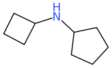
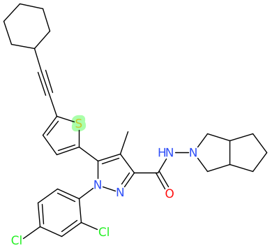

# Scaffolds

This tool extracts all subsets of molecular scaffolds from a molecule.

The tool `molecular_scaffolds` generates all pair-wise scaffolds from a molecule.
This tool should superceed that, since it can generate all subsets. It also has
the ability to preserve the atoms attached to either the ring atoms, and/or to the
linker atoms.

For example, starting with

in which the whole molecule is the Murcko scaffold, these two sub-scaffolds will
be generated


In addition to the individual rings.

A more complex molecule like

will generate 17 separate scaffold subsets.
```
c1ccccc1 CHEMBL524158.0 1
C1CCCCC1 CHEMBL524158.1 1
[s]1cccc1 CHEMBL524158.2 1
c1cc([s]c1)C#CC1CCCCC1 CHEMBL524158.3 2
c1c[n][nH]c1 CHEMBL524158.4 1
c1c[n][n](c1)c1ccccc1 CHEMBL524158.5 2
c1c[s]c(c2[nH][n]cc2)c1 CHEMBL524158.6 2
c1c[s]c(c2[n]([n]cc2)c2ccccc2)c1 CHEMBL524158.7 3
[s]1c(C#CC2CCCCC2)ccc1c1[nH][n]cc1 CHEMBL524158.8 3
[s]1c(C#CC2CCCCC2)ccc1c1[n]([n]cc1)c1ccccc1 CHEMBL524158.9 4
N1CC2CCCC2C1 CHEMBL524158.10 1
O=C(NN1CC2CCCC2C1)c1cc[nH][n]1 CHEMBL524158.11 2
O=C(NN1CC2CCCC2C1)c1cc[n]([n]1)c1ccccc1 CHEMBL524158.12 3
O=C(NN1CC2CCCC2C1)c1cc([nH][n]1)c1[s]ccc1 CHEMBL524158.13 3
O=C(NN1CC2CCCC2C1)c1cc([n]([n]1)c1ccccc1)c1[s]ccc1 CHEMBL524158.14 4
O=C(NN1CC2CCCC2C1)c1cc([nH][n]1)c1[s]c(C#CC2CCCCC2)cc1 CHEMBL524158.15 4
O=C(NN1CC2CCCC2C1)c1cc([n]([n]1)c1ccccc1)c1[s]c(C#CC2CCCCC2)cc1 CHEMBL524158.16 5
```
where there is a consecutive number appended to the name, followed by the number of
ring systems in the scaffold subset.

Using the `-y` option produces output in scaffolds.ScaffoldData
[scaffolds.proto](src/Molecule_Tools/scaffolds.proto) textproto form
```
smi: "C1=CC=CC(=C1)N=NN1CCOCC1" par: "CHEMBL3814820" ring_sys: 2
                subset { smi: "O1CCNCC1" ring_sys: 1 }
                subset { smi: "c1ccccc1" ring_sys: 1 }
                subset { smi: "O1CCN(N=Nc2ccccc2)CC1" ring_sys: 2 }
```
but where output is a single line per molecule.

## Usage
The tool has very few command line options, with most control being available only
by reading a scaffolds.ScaffoldsOptions textproto file via the -C option. That
proto definition, [scaffolds.proto](src/Molecule_Tools/scaffolds.proto) should fully
explain the various options.

The most interesting, and potentially useful options are those related to retaining
some of the non-scaffold atoms in the generated subsets. For example if we wanted
to generate two ring system, scaffold subsets, while retaining the non scaffold atoms
between the ring systems, that control file might look like
```
min_systems_in_subset: 2
max_systems_in_subset: 2
remove_linker_based_non_scaffold_atoms: false
min_length_linker: 3
max_length_linker: 6
max_atoms_in_linker: 9
discard_cyclopropyl_ring: true
```
Note however in the current version the counting of the linker length is wrong.
Currently it is including =O and =N atoms that have been made part of the
scaffold. This will be fixed.
