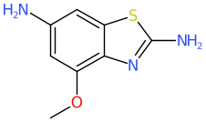
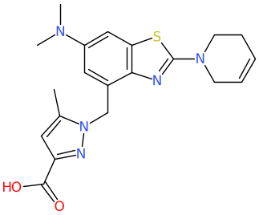
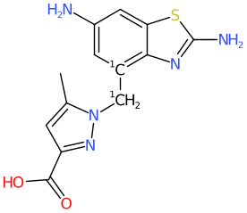

# Substituent Identification.

This tool fragments molecules and stores fragments and their contexts in a
BerkeleyDB database. This database can then be used to suggest new molecules
that are highly likely to be synthetically feasible.

The tool operates in two modes.

1. Profile existing collections to build a database (the -B option)
2. Use that database to generate new plausible molecules.

## Methodology.
During both database builds and lookups an atom typing is used. This
atom typing is used to define some internally computed EC type fingerprints.

### Database Building

During database builds, every single, non-ring bond in the molecule is
broken, one at a time. For each broken bond, as many as two database entries
are then made from those fragments.
Fragments are subject to size constraints, and if the fragments are too large
perhaps nothing will be stored, or maybe just one of the fragments.

Refer to the fragments as the 'anchor' and the 'substituent'. They take
turns in each role. Each will be isotopically labelled at the break
point - which will become attachment points.

For the anchor
```
generate an EC fingerprint from radius [1-max_radius] around the
attachment point.
```
For the substituent
```
form the unique smiles
```
For each radius generated, store an entry in the database. The key consists
of the EC bit value and the corresponding radius. The value will be a 
`substituent_identification::Replacement` proto. This consists of
```
message Replacement {
  // the smiles that can be replaced.
  optional string smiles = 1;
  // The id of the first molecule exemplifying this fragment.
  optional string id = 2;
  // the number of instances of this fragment.
  optional uint32 n = 3;
  // The radius at which this fragment was found
  optional uint32 radius = 4;
}
```
The database value is largely about the sidechain - the database key holds
the information about the anchor.

At this stage we have a database consisting of EC fingerprint values
and associated substituents.

### Using the Database
New molecules are read and fragmented according to user specified substructure
queries.

This operates in two ways, depending on the value of the -k option.

Without the -k option, we assume that the query defines atoms which have
an implicit Hydrogen atom, and we look for substituents that can be added
to those atoms.

With the -k option, the assumption is that bond between the first two
query atoms will be broken, with the first query atom assumed to be
the anchor and the second to be the substituent - which will be
removed, and replaced.

The anchor is fingerprinted, and for each radius/fingerprint combination, the
key is retrieved.

If there is a match, then each of the values stored in the database is a plausible
candidate for replacing the sidechain that has just been removed.

Lookups are first done at the largest radius - in order to ensure the greatest
compatibility of the newly introdued fragment. If the `-a` option is used,
once a match has been found, no smaller radii are checked.

## Usage
The following options are recognised
```
 -d <dbname>   Berkeley database for substituent data
 -R <bonds>    radius for circular fingerprint from attachment point
 -m <natoms>   min number of atoms in a substituent
 -M <natoms>   max number of atoms in a substituent
 -B            flag to enable building
 -w <natoms>   during building, min number of atoms left after removing substituent
 -e            during building, concatenate names of all example molecules (not recommended - too large)
 -h            during building, discern Hydrogen as a substituent

 -q <query>    during addition, query  describing anchor atoms needing new substituents
 -s <smarts>   during addition, smarts describing anchor atoms needing new substituents
 -k            during addition, break bond btw first two matched atoms, discard the fragment
               containing the second atom, and then look for replacements.
               For example to replace an aniline try    -k -s 'c-[NH2]'
 -y            during addition, process all atoms with H's and all non ring single bonds (no -q or -s)
 -L <natoms>   during addition, max atoms lost from parent with -k option
 -r <bonds>    during addition, min radius to be considered
 -a            during addition, only produce molecules at the largest radius found
 -b S,D,T      during addition, only add via the kinds of bond(s) specified
 -C <natoms>   during addition, discard any products with more than <natoms> atoms
 -H ...        during addition, queries that substituents must contain
 -p            during addition, write starting molecule
 -u <number>   during addition, min number of example molecules needed for a fragment to be added
 -V <fname>    during addition, avoid forming any of the molecules in <fname>
 -I            during addition, remove isotopes before writing
 -Y ...        more options, enter '-Y help' for info
 -l            reduce to largest fragment (automatically turned on)
 -c            remove all chirality (automatically turned on during building)
 -i <type>     input specification
 -g ...        chemical standardisation options
 -E ...        standard element specifications
 -A ...        standard aromaticity specifications
 -v            verbose output
```
Both building and using the database require the database name to be specified
via the -d option.

If building the database, the -B option must be used. A typical database build might look
like

```
substituent_identification -d chembl.sbs.db -B -R 3 -w 10 -M 10 -v
                -Y dbproto -Y rpt=10000 chembl.smi
```

We store shells to a maximum of radius 3 (-R 3).

The -w option is potentially controversial. What it specifies is that when
we remove the sidechain is removed, there must be at least 10 atoms left
on the other side. This might be a good idea, or not. It is unclear. The intent
is that we only store contexts associated with complete molecules.

The -M 10 option specifies the maximum size of a substituent. Adjust to taste.

Currently the only way to build a database is as a serialized proto, so the
first -Y option will soon become the default. The other -Y option is just
to help keep track of calculations, reporting progress every 10k molecules
processed. Processing Chembl took about 10 minutes.

In this case the resulting database is 235MB.

Note that the size of the database generated is a strong function of the maximum radius.
For example if the radius is increased to 5 `-R 5` the size of the database is now
1.1GB. That may be desirable in order to provide good molecular contexts for
fragments.

## New Molecules.
During lookups a great many options are available. Let's start with an example.

Given

imagine we would like to replace the methoxy group.

We want a replacement that has at least 5 atoms and also has an oxygen atom
somewhere. We want to have high confidence in the viability of the replacement
so insist on a radius 3 context match. That invocation might look like
```
substituent_identification -v -m 5 -d chembl.db -s 'cO[CD1]' -k
                -H SMARTS:O -p -Y smitextproto -r 3 methoxy.smi
```
This is unfortunately complex, but there is a lot of information being conveyed.

`-m 5` says we want t least 5 atoms in the replacement. Remember the database
was built with a max of 10, so that will be the upper limit of what is returned.

The `-s 'cO[CD1]' -k` combination specifies the bond to be broken, and the
fragment to be removed - the c-O bond is broken and the `O[CH3]` fragment is removed.

We want there to be an oxygen atom somewhere in the replacement fragment, so 
`-H SMARTS:O` does that. Anything that is recognised by the `-q` option to
tsubstructure can be specified here.

The `-r 3` option specifies that as the smallest radius at which we will accept
a match. This is quite large, so we should expect strong context matches.

The -p option says write the parent molecule to the output stream before any
of the variants. This can be useful when reviewing results visually.

The `-Y smitextproto` says that the output will be a leading smiles, followed
by a textproto containing all information about the match. In the case shown
here that is
```
[1C]1(=C2C(=CC(=C1)N)SC(N)=N2)[1CH2]N1N=C(C(O)=O)C=C1C 
        smi: "[1C]1(=C2C(=CC(=C1)N)SC(N)=N2)[1CH2]N1N=C(C(O)=O)C=C1C"
        id: "CHEMBL587076"
        donor: "CHEMBL4088446"
        n: 3
        rad: 3
        frag: "[1OH]C"
```
which is actually written on one line, so it remains a valid smiles file.

So given the molecule above and the existence of this molecule

the tool can form

We see that indeed the context of the two substituents is very
similar, between the starting and product molecules, so there should
be an enhanced probability that the proposed molecule could be made.

Note the conceptual similarity to matched pairs. The tool has some
partially developed matched pairs capabilities that will soon be
cleaned up and released.

Another important option is the `-u` option, which allows specification
of the minimum number of examplar molecules containing a proposed fragment.
The database is built with the most common fragments first for each context.
So, products generated will be ordered by support for the fragment. Either
impose a maximum number of products per starting molecule, `-Y maxgen=nnn`
or impose a support requirement on which fragments get considered `-u 10`.
Hard to know which approach will be most useful.

If you do not have a specific functional group to remove, and are
more interested in addition, omit the `-s and -q` options and it will
assume that all matched atoms with a Hydrogen atom are sites for replacement,
growth in this case.
This may generate large numbers of variants.

The fragment smiles stored in the database may contain an optional trailing
'=' or '#' character. This indicates that this fragment should be joined via
a double or triple bond. The `-b` option controls selection of these join types.

# Summary
substituent_identification is a relatively simple tool that can fairly quickly
generate reasonably large numbers of molecules, especially as support and
radius constraints are relaxed.

The tool is complex, but hopefully straighforward enough for specific tasks.

For example, if the radius is restricted to 3 (above), 385 Chembl molecules
containing methoxy groups generate 885k new molecules  in about
89 seconds.  If the radius restraint is removed, more than 3.27M will be
generated in about 8 minutes. But I did not record the actual number
since the tool has a limit of 10k on the number of variants generated
per starting molecule.  In this case 320 of the starting molecules
would have generated > 10k variants.

You can control that limit via `-Y maxgen=n` if needed.

This tool again points to the fact that generating large numbers of
quite reasonable molecules can be quite straightforward.  The more
difficult task will be the evaluation of such molecules.
