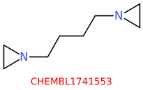
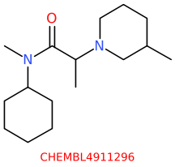
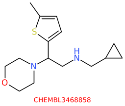
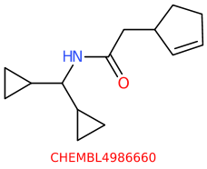
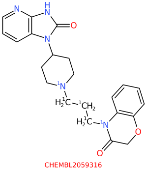
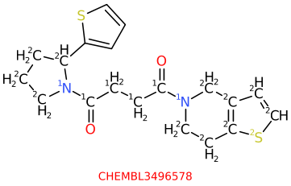
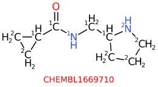
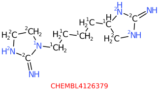
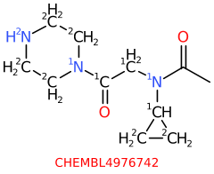

# Nearby Aliphatic Rings

The task is to identify Chembl molecules that exemplify

. aliphatic rings separated by 3-5 bonds
. not too much extra complexity in the inter-ring region.

For example



would be a simple example of the kind of molecule sought. Note that
the molecules shown here may have had irrelevant atoms removed. Here is
a more complex example, 



with a couple of substitutents in the linker. But we want to exclude molecules
like



which have more bulk and complexity in the inter aliphatic ring region
that is desired. And for now, we also specifically exclude molecules like



where there are multiple choices for how to identify the relevant parts
of the molecule, and things would end up being more complex.

## HowTo
As is usually the case, this workflow evolved in an iterative form, and this
document will reflect some of that. There are steps here that could be
combined, but work was more efficient if done incrementally - due to 
constantly reducing the number of molecules being processed and refining
queries.

### Step 1 - two aliphatic rings
The first task is to identify plausible starting molecules. For that we
used
```
tsubstructure -s '[/IWfsid1/IWfss<3AR]...{<6}[/IWfsid2/IWfss<3AR]' -m aliphatic chembl
```
We look for molecules that have two aliphatic rings, that are in different
fused systems, and are separated by less than 6 atoms. Note the use of
`/IWfsid1` and `/IWfsid2` to indicate that the matched atoms must be in
different fused systems
[docs](/docs/Molecule_Lib/substructure.md)
We use `/IWfss<3` to exclude large fused ring systems, in this case
the size of the fused system must be less than three, i.e. one or 
two rings only.
The construct `...{<6}` to indicate the distance between them.

We have 254k starting molecules. Query took 59 seconds.

### Step 2
Unfortunately, it is not possible to combine the `...` construct with
constraints put on the associated atoms, so the best choice seemed to be
to create three separate queries, one for three inter-ring bonds, one for four and one
for five. This seemed very undesirable, but I could not think of a better
way.

Build three query files that look like
```
name: "3"
query {
  smarts: "[/IWfss<3AR]!@-[R0][R0][R0]!@-[/IWfss<3AR]"
  substituent_no_match {
    min_natoms: 8
  }
  substituent_no_match {
    min_nrings: 1
  }
  substituent_no_match {
    min_length: 4
  }
}
```
And in the `4.qry` file there will be found instances of `[R0]`. The
interesting parts are the `substituent_no_match` directives.

A 'substituent' is atoms bonded to the atoms matched by the smarts. In
this case substituents will be the atoms attached to the linker atoms.
But note that a substituent is not a single atom, but a region of the
molecule.

We have three `substituent_no_match` directives. That means that if
this requirement is met, the whole query (smarts) does not match. We
need separate `substituent_no_match` directives since if combined
into one,
```
  substituent_no_match {
    min_natoms: 8
    min_nrings: 1
    min_length: 4
  }
```
the specification would only match a substituent that had all of those
attributes simultaneously. We want to identify and discard molecules,
that have any of these attributes.

The invocation looks like
```
tsubstructure -j 1 -j same -v -q PROTO:3.qry -q PROTO:4.qry -q PROTO:5.qry -m x2 aliphatic.smi
```
which takes 4.5 seconds to process 254k molecules. Note that we could have
done this as the starting search, but these queries took several steps to
refine.

We apply isotope 1 to the matched atoms, which includes the ring atom.

At this stage we have molecules like



where we see that there remain other parts of the molecule that must be removed -
we want only the part of the molecule that includes the aliphatic rings - and
anything fused to them.

### Step 3
We use isotopic labels for a lot of the subsequent processing, and we need to
get isotopes on the atoms we want to keep. First add isotope 2 to all
the ring system atoms that include the isotopically labelled ring atoms. Use this
query to identify those atoms.
```
query {
  ring_system_specifier {
    base {
      environment: "[1AR]"
      set_global_id: 2
    }
    ring_systems_extend_across_spiro_fusions: true
  }
  smarts: "[0/IWgid2]"
}
```
We look for a ring system that contains a `[1AR]` atom. An aliphatic atom,
that is in a ring (redundant) and which has isotope 1. Every atom in that
ring system is assigned global id 2.

Note that we want ring systems to spread across spiro fusions, so that is set.

The smarts then matches any atom that has global id 2. Apply those labels
via
```
tsubstructure -q PROTO:ring_system.qry -j 2 -j same -j noclear -m x3 x2.smi
```
Note the use of `-j noclear` which allows this to add the new isotopic
labels to the existing values - by default they are cleared.

We now have molecules that look like



where we see isotope 2 has been applied to all the other ring atoms.

But note that the '=O' atom does not have an isotope. Nor will any other
atom in this region. There does not appear to be an easy way of propagating
the isotopic labels from the chain out to all the atoms attached to the
chain.

### Step 4
At this stage, the easy way to get rid of the unwanted atoms outside
the ring systems of interest is to use a reaction.
```
scaffold {
  id: 0
  smarts: "[2R]!@-[0R0]"
  break_bond {
    a1: 0
    a2: 1
  }
  remove_fragment: 1
}
```
We look for an atom with isotope 2 that is in a ring. These are the
isotopes we applied above. That atom must be bonded, via a non ring bond,
to an atom with zero isotope. This removes the extra atoms.
```
trxn -z i -z w  -P remove_extra.rxn -S x4 x3.smi
```
Final result contains 22k molecules, including things like





## Conclusion
This is another example of a seemingly simple request being quite difficult to 
implement. But ultimately the task was completed with four commands.
