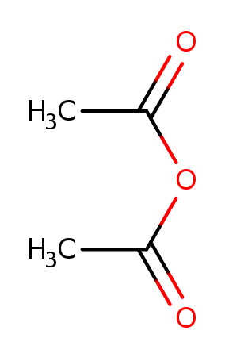
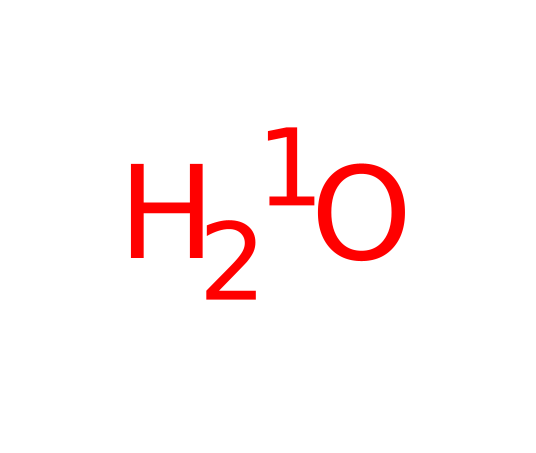

# Ester Hydroloysis
A question came up about using `trxn` to perform ester hydroloysis on molecules
that contained multiple ester groups. In this case we want all ester groups
in the molecule transformed.

## Canidates
If we do a simple search for multiple esters we get things that do not really 
look plausible. Note that if we were searching a set of actual reagents, this
would not be a problem.

Searching for `>1C-[CR0](=O)-[OD2]-C` yields things like


which does match the query, but is implausible. To get a better set of starting
molecules we restrict the number of atoms that can be down the O-C bond to 5.
```
tsubstructure -s '>1C-[CR0](=O)-[OD2]-{a<5}C' ...
```
which matches only molecules with a small number of atoms down that last bond.

## Reaction
The reaction to perform ester hydrolyisis is simple
```
name: "ester hydrolysis"
scaffold {
  smarts: "C-[CR0](=O)-[OD2]-{a<5}C"
  break_bond {
    a1: 3
    a2: 4
  }
  remove_fragment: 4
  isotope {
    atom: 3
    isotope: 1
  }
}
```
To enumerate all esters in each molecule, use trxn with all default options
```
trxn -P hydrolyze_ester.rxn multiple_ester.smi
```
This yields parent/product pairs like


## Problems
Generally this is a desirable outcome. If we had a series of esters each containing
an unknown number of ester groups, this mostly works.

But we did not impose any constraints on the directionality of the esters. For example
if this starting material

is reaction with that reaction, the product is


We can mostly eliminate these with tsubstructure
```
tsubstructure -s '1C-[CR0](=O)-[OD2]-{a<5}C||0C-[CR0](=O)-[OD2]...[OD2]-C(=O)-C' ...
```
which matches molecules that contain either a single ester, or zero occurrences
of esters pointing the wrong way relative to each other. This eliminates things
like

although it does not hit CHEMBL1305819 above.

As is often the case, reagent preparation can be a significant challenge in any
enumeration.

