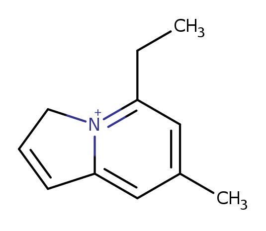
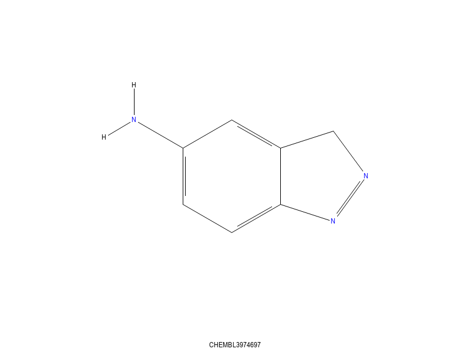
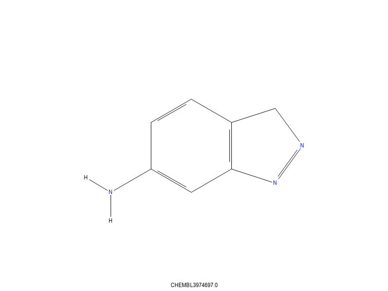
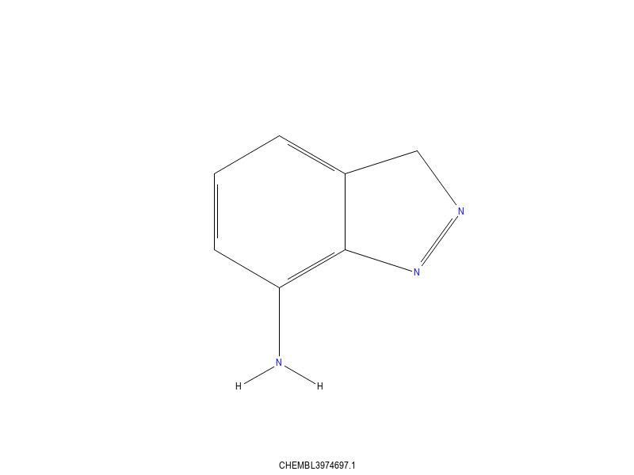
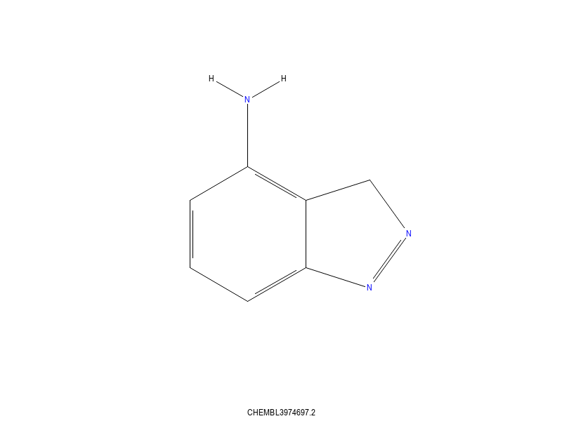
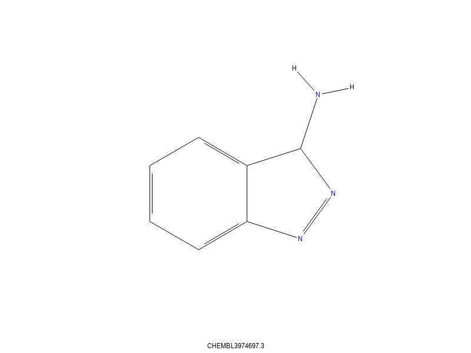

# Walking Functional Groups

During generative molecule production it can be useful to walk a
small functional group to other locations in a molecule.

This can be done via a reaction.
```
name: "move substituent"
scaffold {
  smarts: "[#6H>0]...[*]-!@{a<4}[R0]"
  break_bond {
    a1: 1
    a2: 2
  }
  make_bond {
    a1: 0
    a2: 2
    btype: SS_SINGLE_BOND
  }
}
```
invoked as
```
trxn -P move_group.qry -z i -m each -d -J wrscaf file.smi
```

The smarts is explained as

* A Carbon atom with a Hydrogen attached. This is the recipient.
* No matched atoms between
* The last atom is an atom NOT in a ring.
* The construct `-!@{a>4}` means a non ring bond, and less than 4 atoms down the bond.

This last restriction, prevents large fragments from being moved. The number `4` can
be changed to anything that seems reasonable.

By insisting that the recipient atom be a Carbon atom, we do not have to worry
about forming heteroatom-heteroatom bonds. But it is still possible for undesirable
bonds to be formed - moving a heavy halogen to an aliphatic Carbon atom for example.

One caution. The specification of the donor atom, `*` means that a propyl
group will be broken as

* a proply sybstituent to a hydrogen group.
* a methyl substituent to an ethyl group.
* an ethyl substituent to a methyl group;

This may be desirable or undesirable. See the scaffold suggestion below.

I would recommend using `[G0]` instead of `*`. That will prevent amide and acid bonds
from being broken, leaving aldehydes. The updated smarts will be
```
  smarts: "[#6H>0]...[G0]-!@{a<4}[R0]"
```
Even more restrictive would be to insist on that atom being part of a ring
```
  smarts: "[#6H>0]...[RG0]-!@{a<4}[R0]"
```
or part of the scaffold
```
  smarts: "[#6H>0]...[/IWscaf1G0]-!@{a<4}[R0]"
```
These will all reduce the number of molecules generated, but will also prevent
the propyl substituent case discussed above. Tune to taste...

From 2k set of Chembl molecules that contain a fused aromatic ring system, we generate
11.6k new molecules, or about 5 new
molecules per starting molecule. The log message from `trxn` is interesting
```
Processed 2000 molecules
325 scaffolds had 0 hits
55 scaffolds had 1 hits
94 scaffolds had 2 hits
202 scaffolds had 3 hits
278 scaffolds had 4 hits
255 scaffolds had 5 hits
254 scaffolds had 6 hits
90 scaffolds had 7 hits
88 scaffolds had 8 hits
50 scaffolds had 9 hits
124 scaffolds had 10 hits
45 scaffolds had 11 hits
54 scaffolds had 12 hits
46 scaffolds had 13 hits
17 scaffolds had 14 hits
11 scaffolds had 15 hits
7 scaffolds had 16 hits
1 scaffolds had 17 hits
2 scaffolds had 18 hits
2 scaffolds had 19 hits
220 duplicate products suppressed
```
So 325 molecules did not match the starting query. Two molecules each had 19 hits. Here is
one



we see that the molecule has two functional groups, that are different, and five sites
to which these sidechains could be transferred. The ethyl substituent can be split into
a methyl substituent that gets moved.

Running on the 200k smallest molecules in Chembl generates 3.35M molecules, or about
16 variants per starting molecule. The most prolific molecule generated 118 variants


the reason for so many possibilities is that the molecule contains five substituent
groups and about 13 places to which each group could be transferred. That molecule
has only 19 heavy atoms. This calculation took just under 2 minutes to process
the 200k starting molecules.

Running on the largest 60 molecules in the 'organic' subset of Chembl (50 HA max)
yields 9k molecules, or 157 variants per starting molecule, with one molecule
generating 535 variants. The `-m <max>` option to trxn, which limits the number
of scaffold matches processed might be useful.

## Testing
To understand what this does, it can be useful to start with molecules with isotopes
```
numbered_smiles file.smi
```
generates `file_num.smi` which has the isotope being the atom number - atom 0
will not have an isotope. If this is run through `trxn` as above
you will see how the molecules generated move the functional groups around
the parent.

## Results
Here is a typical outcome, the first molecule is the starting molecule.






We see that the ring substituent has been moved around the ring.
