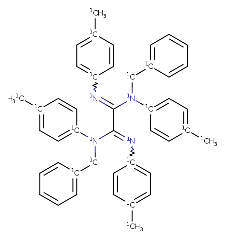
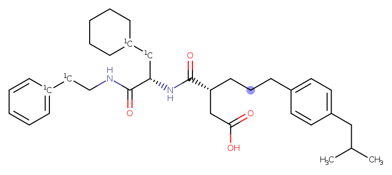
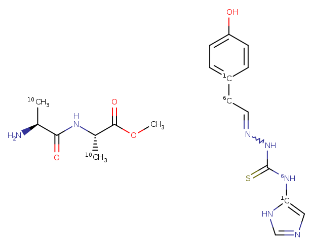

# Linker Replacement

The tool `get_linkers` can be used to extract linker groups from a set of
molecules.

For this exercise we use the corporate collection, chembl and several other
external collections available to us, total 5 collections. For each collection,
run `get_linkers`.
For our purposes, the collections are called a, b, c and d, which contained in
aggregate about 30M molecules.

```
dopattern.sh -do a,b,c,d 'get_linkers.sh -c -l -v -M 16 %.smi > %.linker.smi'
```
Add the -parallel or -cluster options for speed.

Each of the `*.linker.smi` files contains `DicerFragment` text protos and might look
like
```
smi: "[6OH]CCCCNC[6CH3]" par: "CHEMBL368790" n: 5 
smi: "[6CH3]CC(O[6SH](=O)=O)C(C)(C)C" par: "CHEMBL3329777" n: 1 
smi: "[7OH]C(=O)[6CH2][7CH3]" par: "2248334-04-3" n: 1
smi: "[6SH]CCCCCS[6CH3]" par: "CHEMBL48271" n: 1 
smi: "S=C(SCCC(=O)N[6CH3])N[6CH3]" par: "CHEMBL3769563" n: 1 
smi: "OC(CN([6CH3])[6CH3])CC" par: "CHEMBL4906269" n: 2 
smi: "OC(=O)C([6CH3])NC(=O)C(=[6CH2])N[6CH]=O" par: "CHEMBL1864618" n: 48 
smi: "CN(C(=O)CS(=O)(=O)[6CH3])[6CH3]" par: "CHEMBL4920241" n: 14 
smi: "[7CH3]C([6CH]=NOC)OC" par: "CHEMBL212490" n: 2 
```
We see that the linker `[6OH]CCCCNC[6CH3]` occurred in `CHEMBL368790` and
there are 5 occurrences of that linker in Chembl.

## Combining Data
These disparate DicerFragment text protos can be combined using
```
dicer_fragments_collate.py --output=all.smi --smiles=false a.linker.smi b.linker.smi ...
```
resulting in `all.smi` which contains the sum of all the individual
input files. Somewhat surprisingly, this contains only 93k unique linker groups.
The most common one, an amide bonded to two ring carbon atoms, 
```
O=[6CH][6NH2] smi: "O=[6CH][6NH2]" par: "CHEMBL444906" n: 254265
```
is found in 254k molecules across the collections. Interestingly there are also
41k linkers found only in one molecule. These might look like
```
smi: "S=C(S[6CH2][6CH3])N(CC)[6CH3]" par: "CHEMBL4646270" n: 1
smi: "O=[6CH]NC(=NC#N)[6NH2]" par: "CHEMBL2041668" n: 1
smi: "[6OH]CCCCCCC=[6CH2]" par: "CHEMBL1785008" n: 1
smi: "[6CH2]=CC(=O)OCC=C(C)CO[6CH]=O" par: "CHEMBL2063127" n: 1
smi: "O=[6CH]N=C(SCCN(C)C)[6NH2]" par: "CHEMBL2041417" n: 1
smi: "N#CCNC(=O)C(NC(=O)O[6CH3])C[6CH3]" par: "CHEMBL2042007" n: 1
smi: "N#CCNC(=O)C(C[6NH]C)NC(=O)O[6CH3]" par: "CHEMBL2042008" n: 1
smi: "OC(CN([6CH]=O)[6CH3])(C)C" par: "CHEMBL3902850" n: 1
smi: "O=P(NC(C(=O)OCC)CCC)([6OH])[6OH]" par: "CHEMBL2070516" n: 1
smi: "FCC(O[7CH3])C[6SH]=O" par: "CHEMBL1991719" n: 1
```
with singleton linkers found across all collections. Also of interest is
that 83k of the 93k linkers are found in fewer than 10 molecules. This surprised
me. Those low prevalence linkers are spread across the collections, and presumably some
are the result of drawing errors. Presumably some care would be needed when
using singleton linkers.

## Isotopes

The isotopic labels are of interest. By default, `get_linkers`
places an isotope corresponding to the atomic number of what the linker
atom used to be attached to. So isotope 6 means that atom was attached
to a Carbon atom in the parent molecule. The linkers extracted contained
between 2 and 6 attachment points.

| Attachments | Count |
| :---:       | ---: |
|----------- | -------
| 2 | 77888 |
| 3 | 14328 |
| 4 | 1471 |
| 5 | 50 |
| 6 | 11 |
----------

One of the linkers with 6 connections is `[6CH3][6NH]C(=[6NH])C(=[6NH])[6NH][6CH3] EMOL45942818`
.

It is convenient to create separate files for the differing number of 
attachment points.
```
dopattern.rb -a 2 -o 7 tsubstructure.sh  -s '%[>1]' -m % ../all.smi
```
which creates files `2.smi`, `3.smi` ...

For interest, a version of `2.smi` that does not contain any fragments
from the corporate collection is included in the `Data` directory.

## Result
At this stage we have 93k linkers that could possibly be used for
replacing existing linkers.

Let's start with the simplest case, trying to replace a linker between
just two existing rings. We will therefore use the `2.smi` file generated
above since it contains those linkers with 2 attachment points.

We need a query for the starting molecule that identifies two ring atoms,
and the linker atoms between them. For this exercise, we are going to
replace the linker with one of the same length, but that is not necessary,
any length linker can be replaced by any length linker - by removing
the constraints on the smarts used here.

### Scaffold
The scaffold query looks like
```
name: "A linker in the starting molecule"
query {
  smarts: "[R]-!@*...{4;0[R]}*-!@[R]"
  region {
    atom: [0, 3]
    max_natoms: 12
  }
}
```

The smarts contains
* a ring atom
* a non ring bond to another atom
* no matched atoms, 4 intervening atoms, none of which are in a ring
* an atom
* a non ring bond
* a ring atom

This defines the existing linker.

In this case we could have used the more standard
```
[R]!@*!@*!@*!@*!@*!@*[R]
```
but the `{}` notation offers certain conveniences.

The `region` directive is new. When I first did this query I matched
molecules like
```
C(=O)(N[C@H](C(=O)NCCC1=CC=CC=C1)CC1CCCCC1)[C@@H](CC(=O)O)CCCC1=CC=C(C=C1)CC(C)C CHEMBL91054
```

where the "linker" defined between the marked rings is huge, and cannot realistically
be thought of as a linker.

The `region` directive defines a region of the molecule, that is bounded by
the matched atoms specified. In this case, the first and last atoms in
the query, which are the two ring atoms that define the linker. The `max_natoms`
directive says to only make the match if there are at most 12 atoms in this
region. Clearly this is quite restrictive since there are already 6 atoms
in the shortest path. Adjust this number to taste.

In practical applications, it may make sense to isotopically label the
ring atoms of interest and not have to worry about this more general 
problem.

Once we can identify the attachment points, we can make the reaction that
excises the atoms between the attachment points, and inserts a new linker.
This looks like
```
name: "linker replacement"
scaffold {
  id: 0
  query_file: "starting_molecule.textproto"
  break_bond {
    a1: 0
    a2: 1
  }
  break_bond {
    a1: 2
    a2: 3
  }
  isotope {
    atom: 0
    isotope : 1
  }
  isotope {
    atom: 3
    isotope : 1
  }
  isotope {
    atom: 1
    isotope: 10
  }
  isotope {
    atom: 2
    isotope: 10
  }
  # remove_fragment: 1
}
sidechain {
  id: 1
  smarts: "[>1]...{4}[>1]"
  join {
    a1: 0
    a2: 0
    btype: SS_SINGLE_BOND
    isotope_join_requirement: ATOMIC_NUMBER
  }
  join {
    a1: 3
    a2: 1
    btype: SS_SINGLE_BOND
    isotope_join_requirement: ATOMIC_NUMBER
  }
}
```
where `starting_molecule.textproto` is the query shown above.

The reaction is mostly straightforward. The bonds between the ring atoms
and the linker are removed, and isotopic labels are placed on the atoms
being removed. The `remove_fragment` directive will result in removal
of the old linker, but here we leave it to see what is going on.

The sidechain directive is again mostly straightforward, except for the
new directive `isotope_join_requirement`. With this in effect, the reaction
will only occur if the isotope of the atom in the sidechain matches
the atomic number of the atom in the scaffold. This should lead to more
plausible molecules being generated. Linkers will be inserted into the
scaffold with the linker atoms
bonded to same kind of atoms from which they were excised.

Of course if this restriction is omitted, many more variants will be 
produced, but at the risk of lowered synthetic feasibility.

## Results
Running 
```
trxn -Z -v -z i -m each -J numok -P replace_linker.rxn rand.chembl.smi 2.smi
```
takes about 13 seconds to process the 2k molecules in the random file and generates
394k new molecules. That file contains 24k duplicates, even though neither
the starting molecules, nor the replacement linkers contained duplicates. And
of the 77k molecules in `2.smi` only 22k passed the distance filter, and an
average of 197 met the atomic number matching requirment. Clearly more
molecules could be generated if this requirement were relaxed.

Maybe another join requirement directive could be added, to not allow
heteroatom-heteroatom bonds to be formed. That seems like a generally
useful thing to do (thoughts?).

Note that because of the `-J numok` directive, each linker is inserted both
ways into each recipient molecule. This will lead to duplicates if the linker
is symmetric, as observed above.

A typical result might look like



where CHEMBL1472268 has been combined with a linker derived from CHEMBL1823471.

We see that at either end of the new linker, isotope 6 in the linker has
been attached to a carbon atom in the starting molecule. The old linker,
marked with isotope 10, was branched, but this replacement is not. Now, in
this particular case, that replacement does not seem like a particularly interesting
bio-isosteric replacement. If needed, doing a similarity search between the
products and the starting molecules may be useful.

## Conclusions
Two connected linker replacement is viable, quickly generating moderate numbers
of quite reasonable looking molecules. Once candidate linkers are assembled, the
task of linker replacement is straightforward.

Better would be to be more cognizant of the atomic environment when doing
matches. For example right now, matches are by atomic number. Also considering
aromaticity would clearly be a good idea, leading to a higher probability
of generating synthetically feasible molecules. There are plans to do
matching based on atom typing, but that is not implemented.

I did not experiment with replacing with linkers of different length,
but that is clearly straightforward.

I was surprised by what seemed to me to be the comparatively small number
of "linkers" found. Of course my restrictive conditions clearly had 
something to do what that.

## Three attachments
I have not implemented that yet. Partly because the `...` construct does not
really work for defining such a region, and I have not yet implemented
the associated region finding code. The `...` problem can be avoided
with use of a query file, using NoMatchedAtomsBetween or LinkAtoms messages.
If this ever becomes important we can look into it. I believe this query
```
query {
  smarts: "[/IWfsid1RD3x2].[/IWfsid2RD3x2].[/IWfsid3RD3x2]"
  link_atoms {
    a1: 0
    a2: 1
    max_distance: 4
  }
  link_atoms {
    a1: 0
    a2: 2
    max_distance: 4
  }
  link_atoms {
    a1: 1
    a2: 2
    max_distance: 4
  }
  region {
    atom: [0, 1, 2]
    nrings: 0
  }
}
```
would be a possible starting point for a 3 attachments linker, but it remains
hard to identify the attached atoms - since they may be shared by more
than 1 ring.

Clearly this is harder, and perhaps a special purpose linker replacement
tool needs to be built. Or maybe 3+ attachment points is of theoretical
interest only.

Having the ability to insert a linker that might contain a ring is
also potentially of interest.
