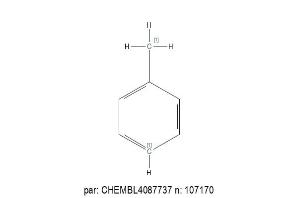
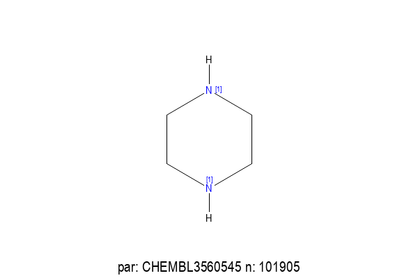
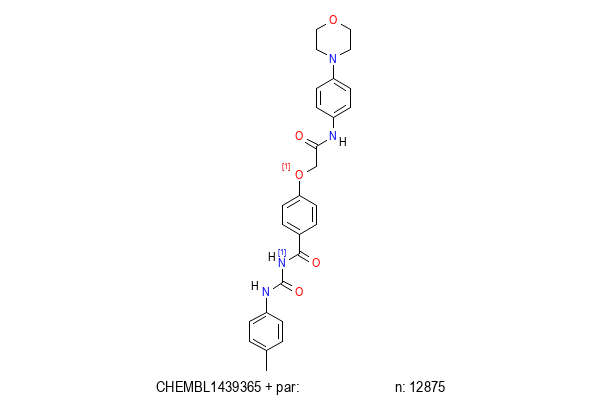

# Linkers with Rings
In an attempt to rigidify interesting molecules we decided to extract all
linker groups containing a single ring system from all known collections.
This is different from the workflow [linker replacement](linker_replacement.md)
where we only
consider linkers that do **not** contain a ring. For that exercise we
wrote a special purpose tool for identifying such regions of a molecule. That
offered several advantages, and perhaps ultimately such an approach
will be needed here.

In this case we use [dicer](/docs/Molecule_Tools/dicer) to break apart
the molecules and then as a post-processing step identify those fragments
that meet our requirements. The previous exercise could also have been
done this way, but making a special purpose tool avoids some of the
post-processing complexity that will be seen here.

## HowTo
The first task is to run `dicer` on all collections available to us,
saving the dicer fragments in serialised proto form. For each collection
a typical command might be
```
dicer -v -M maxnr=12 -B fragstat=collection.bin -B fragstatbinproto -c -I 1 -B nbamide -B brcb -B nooutput -X 500 -k 3 
```
Let's break down the options

### -M maxnr=12
The maximum number of non ring atoms in a fragment. There is no right value for this, adjust
to taste. Remember there will be two chain sections to our linkers - either side of a ring.
### -B fragstat=collection.bin 
Write the fragment summary results for this collection to `collection.bin`. This is a
Tensorflow TFDataRecord file. Usually this will be an ASCII file, but in this case we
will generate larger than usual amounts of data, and it is *much* more efficient to
process this in serialized proto form.

### -B fragstatbinproto
This is what tells `dicer` to write the data as serialized proto form.

### -c
Remove chirality. They are not necessarily helpful here. `dicer` is not entirely
robust with respect to destroyed chiral centers.

### -I 1
Place an isotopic marker at the join points. Note that we have not done anything
specific to the kind of atom that used to be joined. The reason for that is that
we find a **lot** of singleton fragments here, and doing that would result in
even more singleton fragments.

### -B nbamide
Do **not** break amide-like bonds - this should be the default.

### -B brcb
Allow all bonds connecting a ring and a chain to break.:

### -B nooutput
Do not write individual fragments for each molecule, just aggregate results across
all molecules and write the summary.

### -X 500
Limit the number of fragments generated for any molecule. This helps with run-time
since large molecules with large numbers of unbreakable bonds can generate massive
numbers of fragments. The 500 is an arbitrary choice.

### -k 3
Generate fragments with a maxiumum number of bonds broken.

## Results
For each of the collections that contain between 1 and 2 million molecules,
the run times were typically between 1 and 2 hours. There was one collection
that contained 20M molecules. That was chunked into 500k chunks, run separately
on a cluster.

This generates, for each collection, a `collection.bin` file containing summary
inforation in dicer_data::DicerFragment serialized protos. Across all the
collections profiled, there is about 20GB of data.

Since there is expected to be significant linker group overlap between
collections, these protos need to be aggregated. I started with a python
script to do this, but run times and memory requirements rendered it infeasible.
A c++ tool was therefore deployed, and processed most of these files in a couple
of minutes, although it did consume a large amount of RAM.
```
dicer_fragments_collate -p 2 -tfdata -minimal -v -r 500000 c1.bin c2.bin ...
```
The options are
### -p 2
Impose a support constraint of 2 instances. One thing that was surprising (to me)
about this data is the large number of singleton fragments. But despite
throwing away a lot of singletons, we end up with 34.5 million possible
linkers. If you would like more linkers, lift this restriction.

### -tfdata
This tells the tool that the input consists of serialized protos in TFDataRecord
format.

### -minimal
This limits what is stored internally to just the minimum, which for this task
is fine. This helps with memory consumption. Only use this if you need to.

## Structures.
The resulting file, a textproto file, is 2.6GB, containing 24M
fragments.  We want linkers that contain exactly one ring, do not
contain rings larger than 7. We also want those fragments that contain
at least two attachment points. This can be done via
```
fileconv -i textproto -m 7 -r 1 -R 1 -i ICTE -v -S - all.dat | tsubstructure  -s '>1[>0]' -m all.single_ring -v - 
```
which takes about 11 minutes to run. Most of the time is spent in fileconv
decoding the unique smiles. That file contains 2.52M fragments.

It is useful to sort that file by size and other features, as well as the
prevalence - which is column 4 (starting at zero) of the name.
```
msort -k natoms -k amw -k lgrsz -k hetero -k col=4 all.single_ring.smi > all.single_ring.sorted.smi
```
takes about 30 seconds - the parallel version runs in 8, but truncates the name: will fix.

The smallest fragments in there should be unsurprising.


And the most prevalent fragments are






## Linker Functionality
In order to better align with the intended use of these
fragments, we filter them so there is a singly connected
isotopic atom, as well as another isotope with some
ring atoms intervening. There are several choices here.

If we want one singly connected isotopic atom, and
then another anywhere the other side of a ring atom, the
query
```
[1D1]...{>1[R]}[1]
```
will do that. But this will include molecules where the second join
point is itself in a ring. This may be desirable or undesirable
depending. For our purposes, we prefer that second atom to be
beyond the ring. We also restrict attention to molecules with
exactly two isotopes, which will make enumeration easier. Note
however that this discards about 50% of the fragments! The
query
```
2[1]&&[1D1]...{>1[R]}[1R0]
``` 
does this, yielding 339k candidate linkers.

Segregate these into separate files depending on how far apart the
join atoms are.
```
dopattern -o 15 "tsubstructure -m all.linker.% -s '[1]...{%}[1]' all.linker.smi"
```
does that. Some join points are 15 atoms apart. What kinds of molecules might those be


When we generated these fragments, we imposed a limit on the number of non ring
atoms, and as a result we see some undesirable looking fragments. Eliminate
anything with more than 4 atoms in a substituent.
```
tsubstructure -n linker.not_too_long -s '[R]!@{a>4}*' -m too_long all.linker.smi
```
More than four atoms is convenient because it allows things like CF3 to survive.

Re-run the filtering by separation `dopattern` invocation above. Now the longest
separation is 10.

## Results
At this stage we have these populations of ring containing linker groups,
ordered by the number of atoms between the join points. Again, in all
cases, the isotopic labels will be on opposite sides of the ring.
| Separation | Count |
| -------- | ----- |
| 2 | 11834 |
| 3 | 29480 |
| 4 | 38972 |
| 5 | 34072 |
| 6 | 20210 |
| 7 | 8471 |
| 8 | 2636 |
| 9 | 497 |
| 10 | 61 |
-----------

### Usage Example
Take a random Chembl molecule, CHEMBL1439365,


where we will attempt to replace all the atoms between the two
amide groups. The reaction for that might look like
```
name: "Replace linker CHEMBL1439365"
scaffold {
  id: 0
  smarts: "c1ccccc1NC(=O)CSc1nnc(n1C)CC(=O)Nc1ccccc1"
  break_bond {
    a1: 9
    a2: 10
  }
  break_bond {
    a1: 17
    a2: 18
  }
  remove_fragment: 10
}
sidechain {
  id: 1
  smarts: "[1].[1]"
  join {
    a1: 9
    a2: 0
    btype: SS_SINGLE_BOND
  }
  join {
    a1: 18
    a2: 1
    btype: SS_SINGLE_BOND
  }
}
```
Some of the products might be





Probably the most interesting thing of note here is the prevalence
of adjacent amide groups. We broke the starting molecule at a point
that retained an amide group at each end of what was retained. But
amide groups are very common linker attachment points, so we see
too many amides in the product molecules.

Elsewhere in the results we see esters being formed, which
is probably undesirable. Doubtless there are many other problems.

But generally these molecules, with replaced sections seem plausible.

The hardest part of replacing the interior of any molecule is setting
up the job. The reason for this is that while things like substituents
and sidechains are well defined concepts, linkers are not. We could 
just replace every 6 atom scaffold section that joins two rings
```
[R]...{6[R0]}[R]
```
which might be good enough.

But generally this data will be harder to use than other similar things.

## Further Refinements
Isotopic labelling to indicate atom type for joins would seem like
a useful addition in order to maximise synthetic possibilities.

## Subsequent Efforts
In an effort to explore more possibilities, we decided to retain
singletons and remove less desirable atoms. The resulting `dicer_fragments_collate` run consumed
42GB of RAM, and now there are 1.8M fragments that survive.
```
tsubstructure -s B -s P -s I -s Br -n okelements -v all.single_ring.smi
tsubstructure -n linker.not_too_long -s '[R]!@{a>4}*' -m too_long okelements.smi
```
and again the linkers are separated by atoms between the join points.
