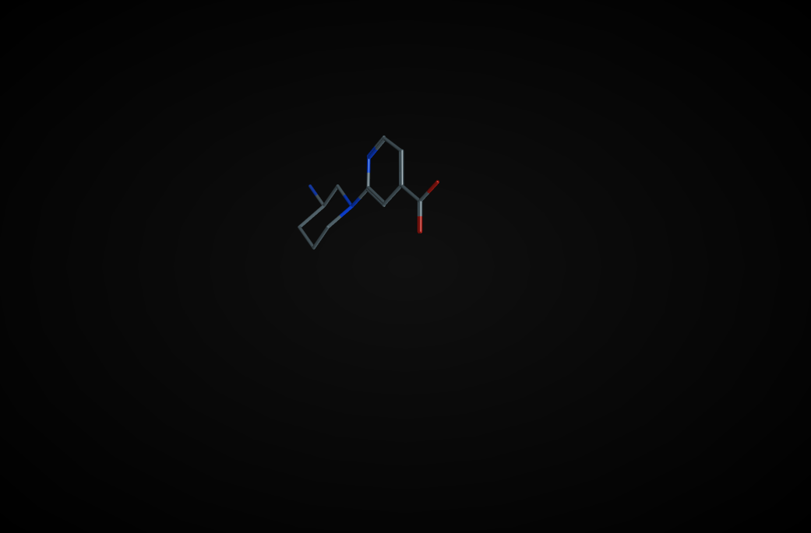

# Reagent Vectors.

A common task with library design is to require a set of reagents that
can orient sidechains in a certain direction. LillyMol had such a tool
many years ago, but usability was poor.

The proto specification of queries enables use of such concepts with
a higher degree of ease of use.

## Acids and Amines
Imagine the common task of looking for reagents that contain both a
carboxyllic acid and a primary amine, which might be used as
a component of a combinatorial library. The substructure search for such
molecules is straightforward.

```
tsubstructure -s '1[OH]-C=O&&1[NH2]-[CX4]' -m acidamine all.smi
```
This query has been performed without constraint on the topological
or spatial distposition of the two groups. Once a starting set has
been identified, it can be refined.

Convert the structures to 3d form
```
rcorina acidamine.smi > acidamine.sdf
```
We might want an aromatic ring in between the two reagents,
and we may wish to enforce some kind of topological separation.
We impose a distance constraint on the distance between the Carbon
of the acid, and the Nitrogen of the amine.

We also impose an angle constraint between the bond that attaches
the acid to the reagent, and the bond that attaches the Nitrogen
of the amide.

Such a query file might look like:
```
query {
  smarts: "[OH]-C(=O)-*...{>3;>1[a]}[CX4]-[ND1H2]"
  geometric_constraints {
    distance {
      a1: 1
      a2: 4
      range {
        min: 6.0
      }
    }
    angle_between_vectors {
      v1 {
        base: 3
        end: 1
      }
      v2 {
        base: 4
        end: 5
      }
      angle {
        min: 120
        max: 180
      }
    }
  }
}
```

We see that the Carbon atom is matched atom 1, the atom that
attached the acid to the scaffold is matched atom 3 and matched atoms
4 and 5 are the amine.

More complexity can of course be added to this query, perhaps an angle
constraint on the matched atoms as well - bond angles do not need to
involve bonded atoms.

A typical result might look like



where we see that the vector defined by the acid and the vector defined by
the amine are pointing away from each other.
