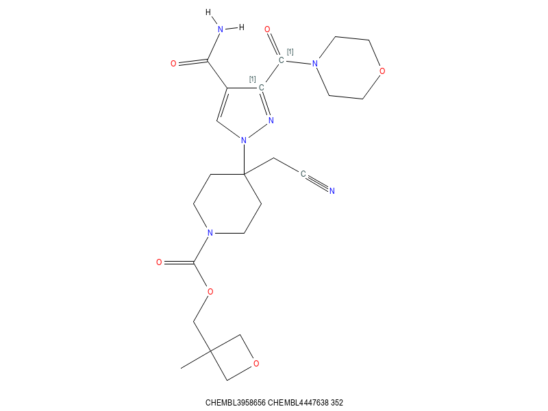

# Sidechain Replacement

A common task in drug design is to replace a sidechain. This is usually driven
by a need to improve interactions with a protein, improve molecular properties,
improve I/P position, or other reasons.

While a *de-novo* tool can be used to suggest new sidechains, exploring known
chemistry first is often a good strategy. By replacing a problematic sidechain
with sidechains that have been observed in exemplified chemistry to exist in a
similar chemical environment, the likelihood of a viable molecule increases.

# Case Study
The most common sidechain replacement is something attached to an aromatic ring.

The first task would be to extract all known aromatic substituents from all
sources at your disposal. In this case we restrict this to Chembl, but in general
more sources should be used.

For this exercise we choose a random molecule from Chembl, CHEMBL3958656

 

and we wish to replace the
-N-phenyl-F group attached to the pyrazole ring at the 3 position.

In order to maximise the probability that our replacement sidechains can be
made, look for sidechains that have been observed attached to such a position in
Chembl. Insist that the fragment have a Fluorine or Nitrogen atom. Note that
by default the `-f` option matches as an **or** condition. If you want it
to match as an **and** condition, add the `-a` option, but that will
necessarily reduce the number of fragments found.
```
time get_substituents.sh -S substituent.smi -n -s '[nr5]1nc(cc1)' -O 2 -m  5 -M 12 -f F -f '[#7]' -I 1 -z i -v chembl.smi
```
which takes 60 seconds to run and reports
```
Read 2213922 molecules
2033449 molecules did not match any of 1 queries 0.918483
62931 fragments generated
12311 fragments did not match substructure constraints
4130 fragments in hash
23359 fragments had 1 atoms
1988 fragments had 2 atoms
5239 fragments had 3 atoms
3804 fragments had 4 atoms
2083 fragments had 5 atoms
6776 fragments had 6 atoms
7731 fragments had 7 atoms
6943 fragments had 8 atoms
5693 fragments had 9 atoms
5487 fragments had 10 atoms
5444 fragments had 11 atoms
4614 fragments had 12 atoms

1256 fragments had 0 rings
13079 fragments had 1 rings
1831 fragments had 2 rings
64 fragments had 3 rings
```

Note that we have placed an isotopic labe of 1 on the matched atom
that will be attached to the core of Chembl

The file created `substituent.smi` is a variant on a protcol buffer
textproto form. It might look like (after sorting on column 11)
```
Fc1cc[1cH]cc1 iso: ATT smi: "Fc1cc[1cH]cc1" par: "CHEMBL501070" nat: 7 n: 981 
[n]1cc[1cH]cc1 iso: ATT smi: "[n]1cc[1cH]cc1" par: "CHEMBL570872" nat: 6 n: 431 
O=[1CH]N1CCOCC1 iso: ATT smi: "O=[1CH]N1CCOCC1" par: "CHEMBL4447638" nat: 8 n: 352 
Fc1ccc([1NH2])cc1 iso: ATT smi: "Fc1ccc([1NH2])cc1" par: "CHEMBL333404" nat: 8 n: 346 
[n]1c[1cH]ccc1 iso: ATT smi: "[n]1c[1cH]ccc1" par: "CHEMBL116938" nat: 6 n: 327 
[1NH2]c1ccccc1 iso: ATT smi: "[1NH2]c1ccccc1" par: "CHEMBL119697" nat: 7 n: 313 
Clc1c[1cH]c(OC(F)F)cc1 iso: ATT smi: "Clc1c[1cH]c(OC(F)F)cc1" par: "CHEMBL4777342" nat: 11 n: 310 
[n]1[1cH]cccc1 iso: ATT smi: "[n]1[1cH]cccc1" par: "CHEMBL118302" nat: 6 n: 183 

[1cH]1cc(N2CCCCC2)ccc1 iso: ATT smi: "[1cH]1cc(N2CCCCC2)ccc1" par: "CHEMBL598946" nat: 12 n: 1 
```
The first sidechain is derived from CHEMBL501070, has 7 heavy atoms and there
are 981 occurrences of that sidechain in Chembl. This is the highest count, and
clearly using this as a replacement would be very low risk in terms of synthetic
feasibility.

last one listed above has only 1 instance, and would therefore be is potentially
higher risk of sythetic difficulties. Of course at this stage, we have no
idea how these particular fragments might actually work for the intended purpose.

Note that at this point, the sidechains retrieved should be further examined
and filtered. It is a small set and any filtering will be very fast.

## Enumeration
With isotopically labelled replacement sidechains available, produce (by hand,
or use the `-Y rmatom=smarts` option in fileconv)
an isotopically labelled version of our starting molecule.


The reaction file needed is very simple.
```
scaffold {
  id: 0
  smarts: "[1]"
}
sidechain {
  id: 1
  smarts: "[1]"
  join {
    a1: 0
    a2: 0
    btype: SS_SINGLE_BOND
  }
}
```
merely joining isotope 1 in the scaffold with isotope 1 in the sidechain via a single bond.
For those more comfortable with smirks,
```
trxn.sh -K '[1:1].[1:2]>>[1:1]-[1:2]' 
```
yields the same result.

## Analysis
If the file from `get_substituents` was used unchanged, there are a bunch of
extra columns in the output. Strip to what is of interest and sort the results
```
iwcut.sh -f 1,7,11 trxn.smi | sort -k 3,3gr | sed -e 's/"//g' > replaced.smi
```
Fetch the top 20 and draw aligned png's with CACTVS's `csib`.
```
csib -atomcolor type -footerproperty E_NAME -height 600 -width 800 -format png -template 'n1ncc(c1)C(=O)N' -templatealign redraw CHEMBL3958656_replaced.smi
```
In each of the images included here, the first token of the footer is the name of
the starting molecule, then the name of the `donor` molecule that provided the
first example of this sidechain, and finally the number of such instances in
Chembl.

Note that indeed each sidechain does have either a Nitrogen atom, and/or a
Fluorine.





Remember, these examples are presented based on prevalence only, not
for any suitability for any particular purpose. In a real world
experiment, these molecules would be extensively filtered to ensure
that they had desirable properties, plausible arrangements of
atoms, did not violate structural filters, etc...

## Conclusion
With just a few commands it is possible to quickly come up with 
topologically plausible *de-novo* generated molecules. And of course
one could simultaneously replace two sidechains by using each
of these generated molecules as a starting point to replace a different sidechain.

In any quest for improved properties via sidechain replacement
starting with known examples may be an efficient and effective means
of exploring plausible structure space. Only after this simple and
cheap approach is applied should more expensive, complex and risky
approaches be applied.

There is of course no guarantee that viable results will emerge, but that
will be true of any method.
for improved properties via sidechain replacement
