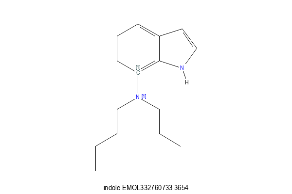

# Sidechain Replacement
The [sidechain_replacement](sidechain_replacement.md) workflow describes a fairly
simple case of sidechain replacement. In this case we describe an (obfuscated)
case that is more complex. This experiments describes how virtual molecules with
varying levels of synthetic risk can be generated.

* In this case we look for features across many collections and aggregate the
results.
* There are specific synthetic restrictions on what can be used.

## The Problem
A team is working with a fused aromatic system, in this example we will use
a 7 substituted Indole as an example. For synthetic reasons, Oxygen and
Nitrogen containing sidechains are preferred, and there can be no more
than 10 heavy atoms in the sidechain.

## The Approach
Profile several available collections for available sidechains.
```
get_substituents -s '[c;r6](!@[N,O]):[c;r5;r6]' -m 3 -M 10 -I 1 -O 1 -z i -n -X anchor -v -S collection collection.smi
```

In this case the smarts is very specific, an aromatic carbon (in the 7 position),
a non ring bond to an atom that is either an aliphatic Nitrogen or Oxygen, and
then the ring atom at the join of the two rings.

The size of the substituent is restricted to being between 3 and 10 heavy atoms.

We place isotope 1 on the join point.

The matched atom to which the substituent is attached is matched atom 1 in
the query above.

Because we specify `-X anchor` that atom will be included in the fragments generated.
This is important because they will be either Nitrogen or Oxygen atoms.

With the `-n` option, we suppress output, and the data will be written as
dicer_data::DicerFragment textproto form to `collection`.

This generates multiple collection files, where the relevant fragments have been
extracted from various locations. These are combined using `dicer_fragments_collate`.

The resulting file contains 7.5k fragments when the corporate collection is
included, 4.4k when only external data sources are used. Here are all the
3 atom fragments (in textproto form, with a leading smiles column) from
the non-Lilly collections.
```
N[1NH]C iso: ATT smi: "N[1NH]C" par: "CHEMBL235087" nat: 3 n: 12
OC[1NH2] iso: ATT smi: "OC[1NH2]" par: "CHEMBL1210307" nat: 3 n: 2
[1NH2]C#N iso: ATT smi: "[1NH2]C#N" par: "51322-80-6" nat: 3 n: 2
[1NH2]NC iso: ATT smi: "[1NH2]NC" par: "CHEMBL102012" nat: 3 n: 2
O=C[1NH2] iso: ATT smi: "O=C[1NH2]" par: "CHEMBL2002965" nat: 3 n: 145
Cl[1NH]C iso: ATT smi: "Cl[1NH]C" par: "64344-21-4" nat: 3 n: 2
C[1NH]C iso: ATT smi: "C[1NH]C" par: "CHEMBL1980511" nat: 3 n: 1250
[1OH]C=C iso: ATT smi: "[1OH]C=C" par: "26560-93-0" nat: 3 n: 2
O[1NH]O iso: ATT smi: "O[1NH]O" par: "EMOL320487975" nat: 3 n: 2
O[1NH]C iso: ATT smi: "O[1NH]C" par: "CHEMBL610560" nat: 3 n: 3
[1OH]CC iso: ATT smi: "[1OH]CC" par: "CHEMBL1984755" nat: 3 n: 470
[1NH2]CC iso: ATT smi: "[1NH2]CC" par: "CHEMBL2002128" nat: 3 n: 179
[1NH2]OC iso: ATT smi: "[1NH2]OC" par: "CHEMBL237173" nat: 3 n: 72
```
which should not be surprising. Note that most of the fragments attach
via a Nitrogen atom, just a couple via Oxygen. If the list of sidechains
is sorted by prevalence that looks like
```
CCC[1NH]CCCC EMOL332760733 3654
C[1NH]C CHEMBL1980511 1250
[1NH2]CCN1C(=O)SCC1=O EMOL179137038 975
[1NH2]Cc1ccccc1 CHEMBL2005278 564
[1OH]CC CHEMBL1984755 470
[1OH]Cc1ccccc1 CHEMBL4288807 442
[1NH2]C1CC1 CHEMBL3355392 342
[1NH2]c1ccccc1 CHEMBL3907997 326
[1NH2]CCCN(C)C CHEMBL1741686 319
[1NH2]C1CCCC1 CHEMBL3134492 318
[1NH2]c1cc2[n]c[nH]c2cc1 EMOL179136426 306
O=C([1NH2])C CHEMBL569454 304
CC[1NH]CC CHEMBL1410726 298
[1NH2]c1c(F)c(c(cc1)F)F EMOL179136729 278
Brc1c(C)ccc([1NH2])c1 EMOL1869268 237
[1NH2]C1CCCCC1 CHEMBL1500217 226
Brc1cc(C)c([1NH2])cc1 EMOL2710500 221
O=C([1NH2])c1ccccc1 CHEMBL3398343 200
Clc1cc([1NH2])ccc1 CHEMBL4204805 197
[1NH2]c1c(cc(c(c1)Cl)Cl)Cl EMOL1965388 195
```
One interesting observation here is the first sidechain, EMOL332760733. That
sidechain is not present, attached to the aromatic as we have specified,
in any of the other collections - `emol` was collated last. So this really does
point to the need to be as exhaustive as possible when doing searches like this.
But within emol there are 3654 instances of this substituent in this kind
of position. The assumption might be that this reflects some combinatorial
exploration of this motif, possibly in molecules that may have
never actually been made. Some caution might be advised.

## Adding the Sidechains
Attaching these molecules to the core is easy, use the same reaction that was
used previously.
```
scaffold {
  id: 0
  smarts: "[1]"
}
sidechain {
  id: 1
  smarts: "[1]"
  join {
    a1: 0
    a2: 0
    btype: SS_SINGLE_BOND
  }
}
```

## Results
For this obfuscated example, we use an Indole as the scaffold, with atom 7 marked with
an isotope. Here is the first product


Within the set of 5.8k enumerated molecules there are definitely problematic things
that should be removed. 5.2k of these molecules survive the Lilly Medchem Rules. Their
clogp profile is attractive
```
clogp 5209 values between -2.828 and 6.194 ave 2.474
```
although given such small molecules, perhaps that is not surprising. The molecule
with the highest clogP value is
```
[1C]1(=C2NC=CC2=CC=C1)[1O]C(Cl)(Cl)C(Cl)(Cl)Cl indole_112870-19-6_1
```
a very unatractive looking molecule, and the lowest clogP comes from
```
[1C]1(=C2NC=CC2=CC=C1)[1NH]CC1=[N+](C)C=CC=C1 indole_000000113966_1
```
which is charged.

This points to the need to always review generated structures for unintended
features. Some may have too many rotatable bonds, not enough rotatable bonds,
bad clogP/PSA or other molecular property, or lack required pharmacaphoric
requirements, etc...

## Stringency
This enumeration only generated 5.8k molecules, but that is only because we made strong
requirements of the fragments to replace - linked via O or N atoms only, and only
in the context of proximity to the ring fusion. These substituents should have very
high probability of being possible to make.

But in order to get more molecules, we can relax this condition. Using the smarts `[c;r6]!@[N,O]`
we get 33k molecules, which include all the previous ones. These molecules will
presumably have a lower probability of being made, since these functional groups
have not been observed at the same site as the earlier ones. But they do satisfy the
requirement of starting with O or N.

If we then remove the restriction of the fragment being attached by O or N, and
allow any fragment that has been found attached to a six membered aromatic ring,
`[c;r6]!@[R0]` (which disallows forming biphenyl type links) we end up with 96k
molecules.  Again, these have even higher risk of synthetic difficulties. Only 69k of
these pass the Lilly Medchem Rules, with clogP reporting
```
clogp 69086 values between -4.554 and 6.755 ave 1.89079
```

## Summary
By tuning the substructure searches used by `get_substituents` we can make
virtual molecules with varying levels of synthetic risk. 

The overall workflow is fairly straightforward

* get_substituents across multiple collections
* dicer_fragments_collate to combine the data across collections
* filter undesirable fragments found - potentially many steps.
* [trxn](/docs/Molecule_Tools/trxn.md) to form the products
