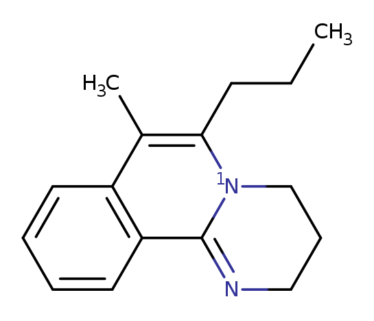
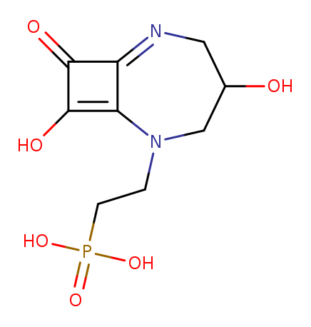
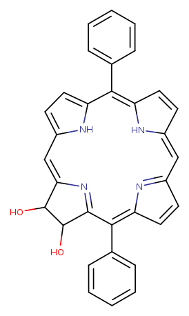

# Substructure Searching

All chemistry environments have advantages and disadvantages. Here we
explore LillyMol and RDKit via their python bindings. Note that python
bindings for LillyMol are experimental and not included in this release.

Past work indicates that between packages there can be differences in
outcomes due to aromaticity perception. Note that there is no definition
of aromaticity, but a general desire to comply with the Kekule concept of '4n+2'.

This study examines minor differences in query matching, as well as timing.

## Methods.
Write a small python tool that consumes two items:

1. A smarts
2. A set of molecules

The molecules are each queried according to the smarts and the molecules
matching are written to a file.

The smarts is specified via the `-s` option, and the file to which matches
are written is specified via the `-m` option, just like `tsubstructure`. The
molecules to be searched are a command line argument, again just like `tsubstructure`.

### RDKit
For RDKit, this program is

```
import sys

from rdkit import Chem

from absl import app
from absl import flags
from absl import logging

FLAGS = flags.FLAGS

flags.DEFINE_string('s', None, 'smarts')
flags.DEFINE_string('m', None, 'file for matches')

def main(argv):
  if FLAGS.s is None:
    print('Must specify smarts via the -s option', file=sys.stderr)
    sys.exit(1)

  query = Chem.MolFromSmarts(FLAGS.s)
  if query is None:
    logging.fatal('Cannot parse smarts %s', FLAGS.s)

  stream_for_matches = None
  if FLAGS.m:
    stream_for_matches = open(FLAGS.m, 'w')

  molecules_read = 0
  number_matches = 0
  with open(argv[1], 'r') as reader:
    for line in reader:
      molecules_read += 1
      mol = Chem.MolFromSmiles(line)
      if mol is None:
        print(f'Skipping {line.rstrip()}')
        continue
      matches = mol.GetSubstructMatches(query)
      if len(matches) > 0:
        number_matches += 1
        if stream_for_matches is not None:
          print(line.rstrip(), file=stream_for_matches)

  logging.info('Read %d molecules, %d match', molecules_read, number_matches)

if __name__ == '__main__':
  app.run(main)
```
Note that it is extremely important that the molecules be sanitized. The tool runs
much faster, but silently gives wrong answers if sanitization is turned off.

### LillyMol
For the LillyMol experimental python bindings, this program is
```
import sys

from absl import app
from absl import flags
from absl import logging

from lillymol import Molecule
from lillymol_query import *

FLAGS = flags.FLAGS

flags.DEFINE_string('s', None, 'smarts')
flags.DEFINE_string('m', None, 'file for matches')

def main(argv):
  if FLAGS.s is None:
    print('Must specify smarts via the -s option', file=sys.stderr)
    sys.exit(1)

  q = query()
  if not q.build_from_smarts(FLAGS.s):
    logging.fatal('Cannot parse smarts %s', FLAGS.s)

  stream_for_matches = None
  if FLAGS.m:
    stream_for_matches = open(FLAGS.m, 'w')

  molecules_read = 0
  number_matches = 0
  with open(argv[1], 'r') as reader:
    for line in reader:
      molecules_read += 1
      mol = Molecule()
      if not mol.build_from_smiles(line):
        print(f'Skipping {line.rstrip()}')
        continue

      if q.substructure_search(mol):
        number_matches += 1
        if stream_for_matches is not None:
          print(line.rstrip(), file=stream_for_matches)

  logging.info('Read %d molecules, %d match', molecules_read, number_matches)

if __name__ == '__main__':
  app.run(main)
```
Again, these python bindings are experimental and may end up being quite
different when we are done.

## Run Times
The following run times are observed when running the smarts 'CCCCN' against
100k random molecules from Chembl. Times are in seconds.

| Tool  | Time | Matches |
| ------ | ------- | ----- |
| tsubstructure | 3.5 | 33466 |
| LillyMol python | 4.19 | 33466 |
| RDKit python | 20.5 | 33473 |

Somewhat surprisingly, there is not a huge difference between LillyMol c++
and LillyMol python. Several other tests confirm this. But in all these
cases there is not much actually being done in python. More realistic
applications would see more logic being done in python.

And to be fair, in this particular case, the RDKit case is transferring
more data back to python because LillyMol does not (yet) pass back the
matched atoms. But even without that, the time difference is significant.

## Differences
As seen above different results are obtained from RDKit and LillyMol. It is
instructive to look closer. The numbers do not sum to 100k since a small
number of Chembl smiles could not be parsed by RDKit.

| LillyMol | Both | RDkit |
| ----- | ------ | ----- |
| 15 | 33451  | 22 |

Overall this is very good, there is excellent agreement between the tools.

Let's take a closer look at the outliers.

### Rdkit Not LillyMol
The most common structural feature leading to this kind of differences is exemplifed by
.

The smarts is 'CCCCN'. The reason Rdkit matches this query is that it considers
the `1N` atom to be aliphatic, whereas LillyMol considers it to be aromatic. In
this case I believe LillyMol is closer to correct.

On the other hand  is not found in LillyMol
because LillyMol has classified the 4 membered ring as aromatic - since it
satisifes '4n+2' with 'n=0'. This is an optional setting in LillyMol, and it
is unclear what 'correct' should be.

All cases of found by Rdkit and not found by LillyMol are analogous to these
two cases.

### LillyMol Not Rdkit
All discrepancies are explained by
.
In this case RDKit has classifed the macrocycle as aromatic, but LillyMol has
a default maximum aromatic ring size of 8, settable via `-A mxars=N`. It is
unclear what 'correct' behaviour is, although the two tools can be brought
into concordance via a command line option.

# Conclusions
Substructure searching via LillyMol python compares favourably with `tsubstructure`
for small to moderate size datasets. RDKit is substantially slower on this (and other)
queries.

Subtle aromaticity differences between environments are to be expected, and
can produce surprising results. It is often unclear what 'correct' should be.
